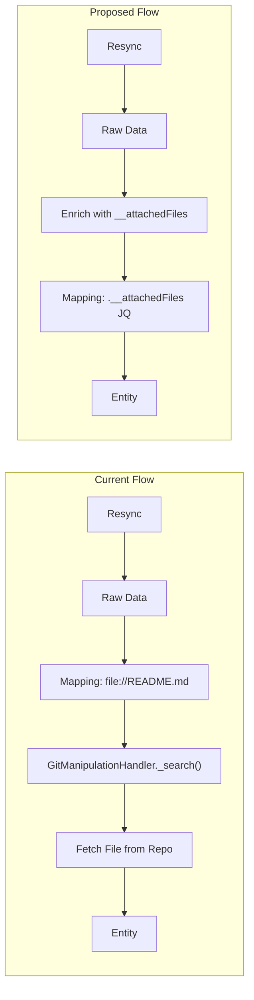

# Implement `attachedFiles` Selector-Based File Enrichment

## Background

Currently, git integrations (GitLab-v2, GitHub, Bitbucket Cloud, Azure DevOps) support a `file://` prefix in the **mapping** phase. When the JQ entity processor encounters `file://README.md` in a property mapping, a custom `GitManipulationHandler` overriding `_search()` intercepts it, fetches the file from the repo, and returns its content. This tightly couples file fetching with entity processing and creates a "ping-pong" between integration code and Ocean core.

The proposed solution moves file fetching to the **selector/enrichment phase**: users declare which files to attach in the selector, the integration fetches them during resync, and the mapping uses pure JQ to access `.__attachedFiles["README.md"]`.



### New YAML Config Shape

```yaml
resources:
  - kind: project
    selector:
      query: "true"
      includeLanguages: "true"
      attachedFiles:        # NEW
        - README.md
        - CODEOWNERS
    port:
      entity:
        mappings:
          identifier: .path_with_namespace | gsub(" "; "")
          title: .name
          blueprint: '"service"'
          properties:
            readme: .__attachedFiles["README.md"]          # NEW (was: file://README.md)
            codeowners: .__attachedFiles["CODEOWNERS"]     # NEW (was: file://CODEOWNERS)
```

## Implementation (Starting with GitLab-v2, then the rest)

### 1. Add `attachedFiles` to `ProjectSelector` in each integration

**GitLab-v2** - [`integrations/gitlab-v2/integration.py`](integrations/gitlab-v2/integration.py):

- Add `attached_files: list[str] = Field(alias="attachedFiles", default_factory=list) `to `ProjectSelector`.

**GitHub** - [`integrations/github/integration.py`](integrations/github/integration.py):

- Add the same field to `GithubRepositorySelector`.

**Bitbucket Cloud** - [`integrations/bitbucket-cloud/integration.py`](integrations/bitbucket-cloud/integration.py):

- Add the same field to `RepositorySelector`.

**Azure DevOps** - Find the appropriate selector (or create one for repositories) and add the field.

### 2. Implement file enrichment method in each integration's client

**GitLab-v2** - [`integrations/gitlab-v2/gitlab/clients/gitlab_client.py`](integrations/gitlab-v2/gitlab/clients/gitlab_client.py):

- Add `_enrich_project_with_files(self, project, file_paths) -> dict` that:

                                                                                                                                                                                                                                                                1. Gets `path_with_namespace` and `default_branch` from the project dict
                                                                                                                                                                                                                                                                2. Fetches each file via `self.rest.get_file_content(project_id, file_path, ref)`
                                                                                                                                                                                                                                                                3. Stores results in `project["__attachedFiles"] = {"README.md": "<content>", ...}`
                                                                                                                                                                                                                                                                4. Handles errors gracefully (missing files return `None`)

- Modify `get_projects()` to accept `attached_files: list[str] `parameter and call `_enrich_project_with_files` via `_enrich_batch()` after languages enrichment.

**GitHub** - Add similar enrichment using existing `RestFileExporter.get_resource()` with `FileContentOptions` (already exists in [`integrations/github/github/entity_processors/file_entity_processor.py`](integrations/github/github/entity_processors/file_entity_processor.py)).

**Bitbucket Cloud** - Add similar enrichment using `bitbucket_client.get_repository_files()`.

**Azure DevOps** - Add similar enrichment using `AzureDevopsClient.get_file_by_branch()`.

### 3. Wire enrichment into resync handlers

**GitLab-v2** - [`integrations/gitlab-v2/main.py`](integrations/gitlab-v2/main.py):

- In `on_resync_projects()`, read `selector.attached_files` from the config and pass it to `client.get_projects()`.

**GitHub** - [`integrations/github/main.py`](integrations/github/main.py):

- In `resync_repositories()`, after fetching repositories, enrich them with attached files if configured.

**Bitbucket Cloud** and **Azure DevOps** - Same pattern in their respective resync handlers.

### 4. Backward compatibility (silent migration)

Keep the existing `GitManipulationHandler` (with `file://` prefix support) working for now:

- The `GitManipulationHandler._search()` override remains functional so existing configs using `file://` continue to work without changes.
- Both approaches coexist: users can use `file://` in mappings OR `attachedFiles` in selector + JQ in mappings.
- Eventually, `file://` can be deprecated in a future version.
- Optionally log a deprecation warning when `file://` prefix is detected in mapping patterns.

### 5. Update default port-app-config files

Update `.port/resources/port-app-config.yml` in each integration to use the new `attachedFiles` approach:

- [`integrations/gitlab-v2/.port/resources/port-app-config.yml`](integrations/gitlab-v2/.port/resources/port-app-config.yml)
- [`integrations/gitlab/.port/resources/port-app-config.yaml`](integrations/gitlab/.port/resources/port-app-config.yaml)
- [`integrations/github/.port/resources/port-app-config.yml`](integrations/github/.port/resources/port-app-config.yml)

### 6. Handle live events / webhooks

For webhook-triggered updates (e.g., push events), the enrichment needs to also apply:

- When a project/repo entity is updated via a webhook, the live event processor should also enrich with `__attachedFiles` before registering raw data.
- This applies to push hooks in GitLab-v2 ([`integrations/gitlab-v2/gitlab/webhook/webhook_processors/`](integrations/gitlab-v2/gitlab/webhook/webhook_processors/)) and equivalent handlers in other integrations.

### 7. Tests

For each integration:

- Unit tests for the new `_enrich_project_with_files` method (test that files are fetched and stored correctly, handle missing files, handle API errors).
- Unit test for the selector model to verify `attachedFiles` field parsing.
- Verify backward compatibility: `file://` prefix still works.

## Order of Implementation

Focus on **GitLab-v2 first** as it has the cleanest enrichment pattern (`_enrich_batch`, `_enrich_project_with_languages`). Once validated, replicate the pattern to GitHub, Bitbucket Cloud, and Azure DevOps.