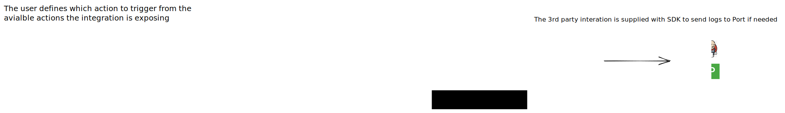

# Integration Framework

Integration Framework is a solution developed by Port to address the challenges faced while integrating various third-party systems with our developer portal product. This framework provides a standardized approach for implementing integrations, simplifying the process and allowing platform engineers to focus on the core functionality of the third-party system.

## Export Architecture


## Self Service Architecture


## Folder Structure
The Integration Framework follows a specific folder structure within the mono repository. This structure ensures proper organization and easy identification of integration modules. The suggested folder structure is as follows:

```
integration-framework/
├── framework/
│ ├── main.py
│ └── requirements.txt
| └── ...
└── integrations/
├────integration_name/
│ ├──── main.py
│ └──── requirements.txt
├── ...
└── ...
```

- The `framework` folder contains the core logic for managing the integration lifecycle.
- Each integration is represented by a separate folder inside the `integrations` directory.
- Inside each integration folder, you'll find a `main.py` file that implements the core functionality of the integration for the specific third-party system.
- The `requirements.txt` file inside each integration folder lists the required dependencies for that integration.

## Integration Lifecycle
The lifecycle of an integration within the Integration Framework follows these steps:

1. **Initialization**: On startup, the Integration Framework reads the `config.yaml` file to determine the integrations to be used. For each integration, it loads the corresponding module and performs necessary setup steps. The Integration Framework updates Port with the identifier and type of each integration.

2. **Listening for Changes**: The Integration Framework continuously listens to the configured trigger channel (e.g., Kafka or webhook).

3. **Resynchronization**: When a change is detected, the Integration Framework triggers the appropriate functions within the integration modules. These functions allow the integrations to synchronize with the updated mappings or perform any necessary actions.

By following this lifecycle, the Integration Framework simplifies the integration process and ensures a standardized approach to integrating various third-party systems with Port.

## Configuration
The Integration Framework utilizes a `config.yaml` file for configuration. This file specifies the integrations to be used within an array. Each integration has a unique identifier and type, which are used during initialization to update Port accordingly.

Example `config.yaml`:
```yaml
port:
  clientId: PORT_CLIENT_ID # Can be loaded via environment variable: PORT_CLIENT_ID
  clientSecret: PORT_CLIENT_SECRET # Can be loaded via environment variable: PORT_CLIENT_SECRET
  baseUrl: https://api.getport.io/v1
triggerChannel: 
  type: KAFKA
integrations:
  # The name of the integration.
  - identifier: "my_kafka_integration"
    # The type of the integration.
    type: "kafka"
    # The configuration of the integration.
    config:
      bootstrap_servers: "localhost:9092"
```

## Contributing
We welcome contributions to the Integration Framework project. If you have any suggestions, bug reports, or would like to contribute new features, please follow our guidelines outlined in the `CONTRIBUTING.md` file.

## License
The Integration Framework is open-source software licensed under the [Apache 2.0 License](https://www.apache.org/licenses/LICENSE-2.0). See the `LICENSE` file for more details.

## Contact
For any questions or inquiries, please reach out to our team at support@getport.io