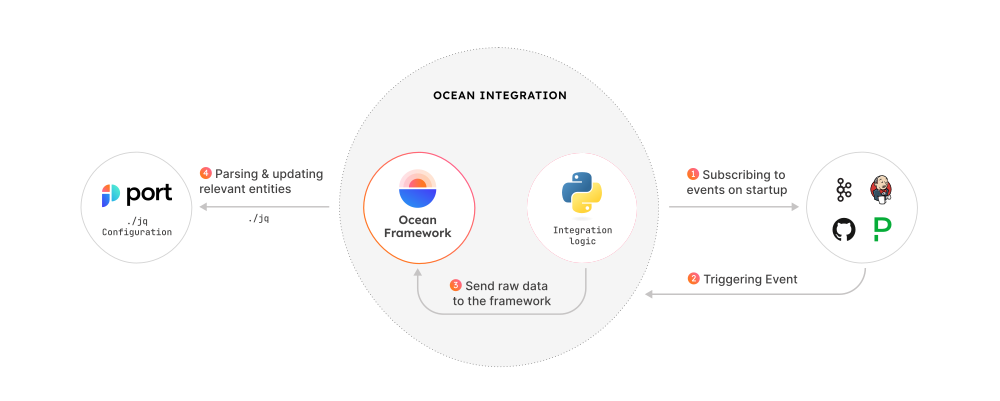
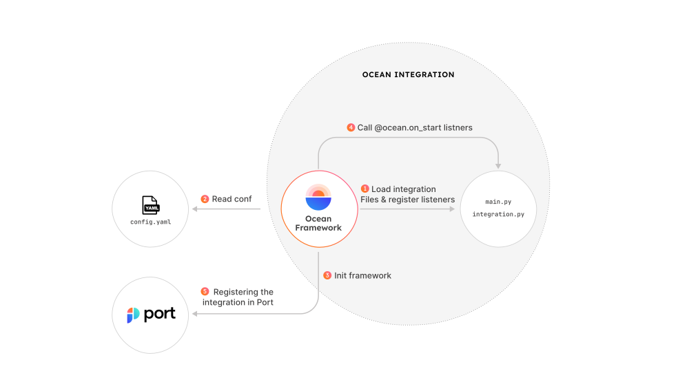

# Ocean 

[](https://github.com/port-labs/port-ocean/actions/workflows/lint.yml)
[](https://deepwiki.com/port-labs/ocean)

Ocean is an innovative solution developed by Port to seamlessly integrate various third-party systems with our developer portal product,
empowering engineers to effortlessly prioritize key features and streamline the integration process.

## Prerequisites

- Python 3.11

## Installation

In order to install the Ocean Framework, run the following command:

```bash
pip install "port-ocean[cli]"
```

Or

```bash
poetry add "port-ocean[cli]"
```

## Run Integration

1. source the integration venv

   ```bash
   . .venv/bin/activate
   ```

2. Run

   ```bash
   ocean sail ./path/to/integration
   ```

# Export Architecture


## Real-Time updates Architecture



## Integration Lifecycle



## Folder Structure

The Ocean Integration Framework follows a specific folder structure within this mono repository. This structure ensures proper organization and easy identification of integration modules. The suggested folder structure is as follows:

```
port-ocean/
├── port_ocean (framework)/
│ ├── ocean.py
│ ├── core/
| └── ...
└── integrations/
│  └─── integration_name/
│     ├──── main.py
│     ├──── pyproject.toml
│     └──── Dockerfile
├── ...
└── ...
```

- The `framework` folder contains the core logic for managing the integration lifecycle.
- Each integration is represented by a separate folder inside the `integrations` directory.
- Inside each integration folder, you'll find a `main.py` file that implements the core functionality of the integration for the specific third-party system.
- The `pyproject.toml` file inside each integration folder lists the required dependencies for that integration.

## Configuration

The Integration Framework utilizes a `config.yaml` file for its configuration. This file defines both the framework configuration and the integration configuration within it. Each integration is identified by its type and unique identifier, which are utilized during initialization to appropriately update Port.

Example `config.yaml`:

```yaml
# This is an example configuration file for the integration service.
# Please copy this file to config.yaml file in the integration folder and edit it to your needs.

port:
  clientId: PORT_CLIENT_ID # Can be loaded via environment variable: PORT_CLIENT_ID
  clientSecret: PORT_CLIENT_SECRET # Can be loaded via environment variable: PORT_CLIENT_SECRET
  baseUrl: https://api.getport.io/v1
# The event listener to use for the integration service.
eventListener:
  type: KAFKA / WEBHOOK
integration:
  # The name of the integration.
  identifier: "my_integration"
  # The type of the integration.
  type: "PagerDuty"
  config:
    my_git_token: "random"
    some_other_integration_config: "Very important information"
```

## Contributing

The reason Ocean is open source is that we aim for the Port integration library to offer numerous useful out-of-the-box integrations. We have confidence that developers and DevOps professionals who rely on Port in their everyday work will be inclined to contribute and assist in making it a comprehensive tool.

In order to learn how you can contribute to Ocean, read our [contributing guide](./CONTRIBUTING.md)

### Local Development (Framework)

1. Clone the repository

2. Install dependencies:

   ```bash
   make install
   ```

   Or (For installing integrations dependencies as well)

   ```bash
   make install/all
   ```

3. source the integration venv

   ```bash
   . .venv/bin/activate
   ```

### Local Development (Integration)

1. Clone the repository

2. For new integration run

   ```bash
   make new
   ```

   and follow the instructions

3. Install dependencies

4. ```bash
   cd DESIRED_INTEGRATION_FOLDER && make install
   ```

5. source the integration venv

   ```bash
   . .venv/bin/activate
   ```

6. Run the integration

   ```bash
   make run
   ```

   Or

   ```bash
   ocean sail
   ```

## License

The Ocean Framework is open-source software licensed under the [Apache 2.0 License](https://www.apache.org/licenses/LICENSE-2.0). See the [LICENSE](./LICENSE) file for more information.

## Contact

For any questions or inquiries, please reach out to our team at support@getport.io
