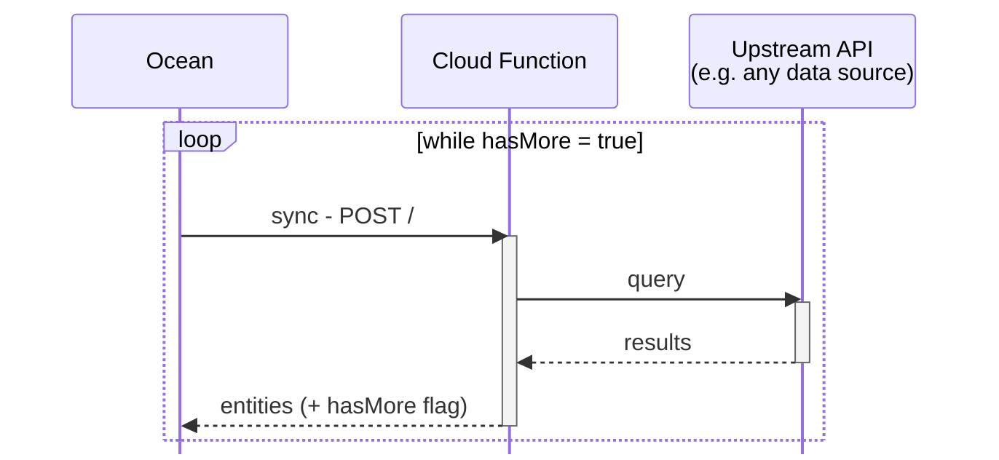

# Cloud Function

An integration to sync data from an upstream API to Port via a Cloud Function.

This allows for a more custom integration while not having to deal with all the power of Ocean's API.

## HTTP Protocol



## Example request & response
Request: `ocean -> cloud_function`
```json
{
    "agent" : "<integration_identifier>/<version>",
    "state": null,
    "secrets": {
        "apiToken": "abcdefghijklmnopqrstuvwxyz_0123456789"
    }
}
```

- `agent`: string identifying the integration and its version.
- `state`: opaque object containing the integration's state, used for pagination and tracking progress. `null` if this is the first synchronization.
- `secrets`: object containing sensitive information required for the integration to function, such as API tokens or credentials.

Response: `cloud_function -> ocean`
```json
{
  "state": {
    "last": 83838
  },
  "insert": [
    {
      "id": 101,
      "name": "Christmas"
    },
    {
      "id": 102,
      "name": "New Year"
    }
  ],
  "hasMore": true
}
```
- `state`: opaque object containing the integration's state, will be passed back in the next synchronization.
- `insert`: array of entities to insert into Port.
- `hasMore`: boolean indicating whether there are more entities to import.
