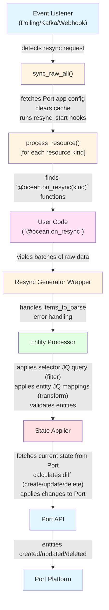

# 🔄 Data Flow Architecture

This document describes the complete data flow process when Ocean performs a resync, from the initial trigger through data transformation to final synchronization with Port.

## Complete Data Flow Diagram



## Step-by-Step Process

### Step 1: Resync Triggered

When an event listener detects a resync request, `sync_raw_all()` is called:

**What happens before user code**:
- Fetches latest resource mappings from Port
- Initializes metrics for tracking
- Clears any cached data
- Runs `@ocean.on_resync_start()` hooks

### Step 2: Process Each Resource Kind

For each resource kind defined in the mapping, Ocean processes it sequentially.

### Step 3: Execute User Resync Functions

Ocean finds and executes `@ocean.on_resync(kind)` decorated functions:

**User code execution**:
- Finds matching resync functions for the resource kind
- Executes async generator functions
- Collects yielded batches of raw data

**Example user code**:
```python
@ocean.on_resync("project")
async def resync_projects(kind: str) -> ASYNC_GENERATOR_RESYNC_TYPE:
    client = create_client()
    async for projects in client.get_paginated_projects():
        yield projects  # Raw data batches
```

### Step 4: Process Raw Data Batches

Ocean wraps the user's async generator:

**What happens**:
- Iterates over async generator from user code
- Handles `items_to_parse` configuration (for nested arrays)
- Yields batches for processing
- Handles errors and aborts gracefully

### Step 5: Transform Raw Data to Entities

The Entity Processor applies JQ mappings to transform raw data:

**Transformation process**:
1. **Extract**: Apply selector JQ query to filter raw data
2. **Map**: Apply entity mappings (identifier, title, properties, relations)
3. **Validate**: Check required fields, handle errors
4. **Format**: Convert to Port Entity format

**JQ Processing**:
- Uses `jq` library to apply JQ expressions
- Compiles patterns for performance
- Processes in parallel (multiprocessing for sync patterns)
- Handles errors gracefully

### Step 6: Calculate State Diff

Ocean compares new entities with existing ones:

**What happens**:
- Fetches existing entities from Port (matching user agent)
- Compares with new entities
- Calculates differences:
  - **Created**: Entities that don't exist in Port
  - **Updated**: Entities that exist but changed
  - **Deleted**: Entities in Port but not in new data

### Step 7: Apply Changes to Port

The State Applier sends changes to Port:

**What happens**:
- **Upsert**: Creates new entities or updates existing ones
- **Delete**: Removes entities that no longer exist (with safety checks)
- **Ordering**: Processes entities in topological order (respects dependencies)
- **Relations**: Handles entity relationships

### Step 8: Reconciliation

Final reconciliation ensures consistency:

**Final step**:
- Performs final reconciliation
- Ensures consistency
- Updates metrics
- Reports completion status

## Understanding the Flow

The data flow follows a classic ETL (Extract, Transform, Load) pattern:

1. **Extract**: User code fetches raw data from third-party APIs
2. **Transform**: JQ mappings convert raw data to Port entities
3. **Load**: State applier syncs entities with Port

Each step is designed to be:
- **Efficient**: Processes data in batches
- **Resilient**: Handles errors gracefully
- **Observable**: Tracks metrics throughout
- **Flexible**: Supports various data structures and patterns
