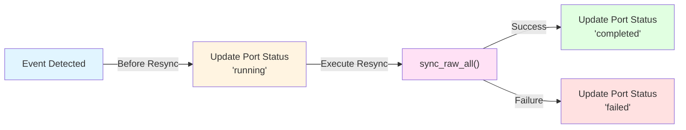

# 🔈 Event Listeners Architecture

Event listeners are the entry point for resync requests. They monitor Port for configuration changes or resync requests.

## Types of Event Listeners

1. **POLLING**: Queries Port API at intervals
2. **KAFKA**: Consumes messages from Kafka topic
3. **WEBHOOK**: Receives HTTP requests from Port
4. **ONCE**: Runs resync once and exits
5. **WEBHOOKS_ONLY**: Only processes webhooks, no resync
6. **ACTIONS_ONLY**: Only processes actions, no resync

## Event Listener Flow

When an event listener detects a resync request:

**Steps**:
1. **Before Resync**: Updates Port with "running" status
2. **Execute Resync**: Calls `sync_raw_all()`
3. **After Resync**: Updates Port with "completed" status
4. **On Failure**: Updates Port with "failed" status

## How Event Listeners Work

Each event listener type implements the `BaseEventListener` interface and follows this pattern:

1. **Monitor**: Continuously monitors for resync requests (polling, Kafka messages, HTTP requests)
2. **Detect**: Detects when a resync is needed (configuration change, explicit request)
3. **Trigger**: Calls the resync handler (`sync_raw_all()`)
4. **Track**: Updates Port with the resync status throughout the process

For more details on configuring and using event listeners, see the [Event Listener](../features/event-listener.md) documentation.
