# 🏗️ Framework Architecture

This document provides a high-level overview of how the Ocean framework works. For detailed information about specific aspects, see the architecture sections below.

## Overview

Ocean is a framework that orchestrates data synchronization between third-party systems and Port. It handles:

- **Event Management**: Listening for resync requests from Port
- **Data Extraction**: Running user-defined resync functions
- **Data Transformation**: Converting raw data to Port entities using JQ mappings
- **State Synchronization**: Comparing and syncing entities with Port
- **Real-time Updates**: Processing live events from third-party systems

## Architecture Documentation

- **[Initialization Flow](./initialization.md)** - How Ocean initializes when an integration starts
- **[Event Listeners](./event-listeners.md)** - How event listeners monitor and trigger resyncs
- **[Data Flow](./data-flow.md)** - Complete data flow from resync trigger to Port synchronization
- **[Live Events Processing](./live-events.md)** - How Ocean processes live events from third-party systems
- **[Framework Internals](./internals.md)** - Event context, metrics, error handling, and caching

## High-Level Architecture

```mermaid

flowchart TB
    subgraph Port["Port Platform"]
        Kafka["Kafka Topic"]
        Webhook["Webhook Endpoint"]
        Polling["Polling API"]
    end

    subgraph Ocean["Ocean Framework"]
        EventListener["Event Listener Layer<br/>(Kafka/Polling/Webhook/Once/ActionsOnly)"]
        EventHandler["Event Handler (sync_raw_all)<br/>• Fetch Port app config<br/>• Clear cache<br/>• Execute resync_start hooks"]
        UserCode["User Integration Code<br/>(ocean.on_resync)<br/>• Fetch data from 3rd-party API<br/>• Yield batches of raw data"]
        EntityProcessor["Entity Processor<br/>(JQ Transformation)<br/>• Apply JQ mappings to raw data<br/>• Transform to Port entity format<br/>• Validate entities"]
        StateApplier["State Applier<br/>(Port API Client)<br/>• Compare with existing entities<br/>• Calculate diff (create/update/delete)<br/>• Apply changes to Port"]
    end

    PortAPI["Port API"]

    Kafka --> EventListener
    Webhook --> EventListener
    Polling --> EventListener

    EventListener --> EventHandler
    EventHandler --> UserCode
    UserCode --> EntityProcessor
    EntityProcessor --> StateApplier
    StateApplier --> PortAPI

    style Port fill:#e1f5ff
    style Ocean fill:#fff4e1
    style PortAPI fill:#e1f5ff
    style EventHandler text-align:left
    style UserCode text-align:left
    style EntityProcessor text-align:left
    style StateApplier text-align:left
```

## Summary

The Ocean framework orchestrates a complete ETL pipeline:

1. **Listen**: Event listeners monitor for resync requests
2. **Extract**: User code fetches data from third-party APIs
3. **Transform**: JQ mappings convert raw data to Port entities
4. **Load**: State applier syncs entities with Port
5. **Monitor**: Metrics track the entire process

All of this happens automatically - you just need to implement the `@ocean.on_resync()` functions that yield raw data batches.
