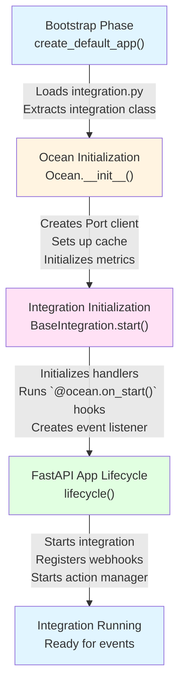

# 🚀 Initialization Flow

When an integration starts, Ocean goes through the following initialization steps:

## 1. Bootstrap Phase

The `create_default_app()` function loads the integration module and creates the Ocean instance:

**What happens**:
- Loads `integration.py` from the integration directory
- Extracts custom integration class (if exists)
- Creates `Ocean` instance with configuration

## 2. Ocean Initialization

The `Ocean.__init__()` method sets up core components:

**What happens**:
- Creates Port API client with credentials
- Sets up caching mechanism
- Initializes metrics collection
- Prepares webhook and action processors

## 3. Integration Initialization

The `BaseIntegration.start()` method initializes the integration:

**What happens**:
- Initializes handlers (entity processor, port app config handler, etc.)
- Executes `@ocean.on_start()` decorated functions
- Creates event listener based on configuration
- Starts listening for events

## 4. FastAPI App Lifecycle

The FastAPI lifecycle context manager orchestrates startup:

**What happens**:
- Starts integration
- Registers webhook processors (if enabled)
- Starts action execution manager (if enabled)
- Sets up scheduled resync (if configured)
