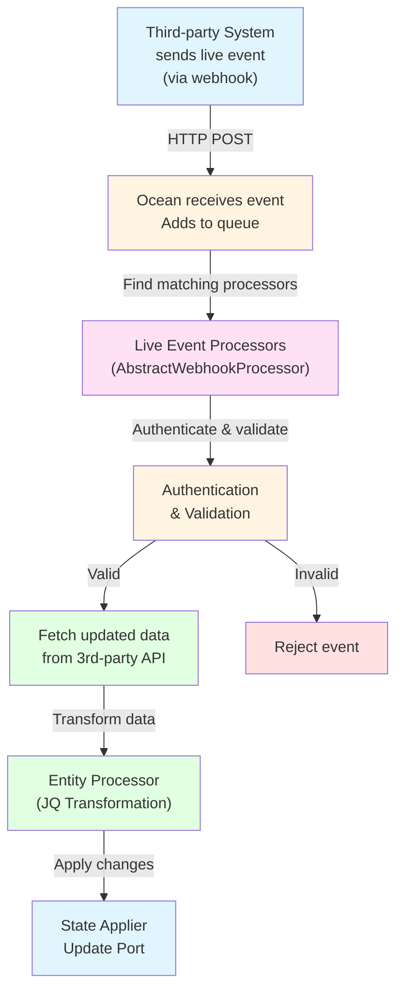

# 🪝 Live Events Processing Architecture

Ocean processes live events from third-party systems (delivered via HTTP webhooks) to provide real-time updates to Port.

:::note Terminology
Live events are delivered to Ocean via HTTP webhooks (POST requests). While we use "live events" in documentation, the technical implementation uses webhooks as the transport mechanism.
:::

## Live Events Flow

## Live Events Processing Steps

1. **Receive live event**: Ocean receives HTTP POST request (webhook) from third-party system and adds it to a processing queue
2. **Find matching processors**: Ocean identifies which live event processors should handle this event based on `should_process_event()`
3. **Authenticate and validate**: Processors verify the event is legitimate (`authenticate()`) and payload is valid (`validate_payload()`)
4. **Fetch updated data**: Processors fetch the latest data from the third-party API (webhook payloads often don't contain complete data)
5. **Transform and apply changes**: Data is transformed using JQ mappings and applied to Port via the state applier

## Key Differences from Resync

Live event processing differs from resync in several ways:

- **Triggered by external events**: Live events are triggered by third-party systems, not Port
- **Processes single resources**: Typically handles one resource at a time (the one that changed)
- **Real-time**: Updates happen immediately when events occur
- **Selective**: Only processes events that match configured live event processors
- **Asynchronous processing**: Uses worker queues for parallel processing
- **Built-in retries**: Automatic retry logic with exponential backoff

## Processing Architecture Details

### Event Queuing

Live events are queued before processing, allowing:
- **Multiple workers** to process events in parallel (configurable via `event_workers_count`)
- **Non-blocking** HTTP responses (returns immediately after queuing)
- **Better reliability** with retry mechanisms

### Processor Selection

Multiple processors can be registered for the same endpoint. Ocean routes events to processors based on:
- `should_process_event()` - Determines if a processor should handle the event
- `get_matching_kinds()` - Identifies which resource kinds are affected

### Error Handling

Processors include built-in error handling:
- **Retry logic** with configurable delays (`max_retries`, `initial_retry_delay_seconds`, etc.)
- **Error hooks** via `on_error()` method
- **Cancellation support** via `cancel()` method

For more details on implementing live event processors, see the [Implementing Live Events](../../developing-an-integration/implementing-live-events.md) guide.
