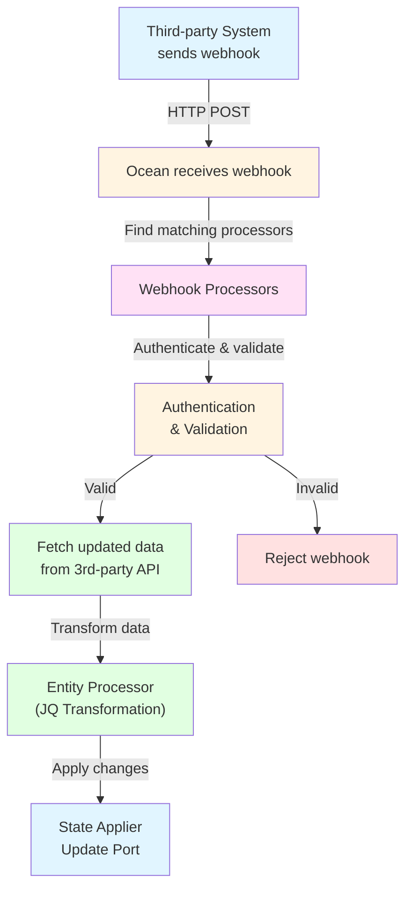

# 🪝 Webhook Processing Architecture

Ocean processes webhooks from third-party systems to provide real-time updates to Port.

## Webhook Flow

## Webhook Processing Steps

1. **Receive webhook**: Ocean receives HTTP POST request from third-party system
2. **Find matching processors**: Ocean identifies which webhook processors should handle this event
3. **Authenticate and validate**: Processors verify the webhook is legitimate and payload is valid
4. **Fetch updated data**: Processors fetch the latest data from the third-party API (webhook payloads often don't contain complete data)
5. **Transform and apply changes**: Data is transformed using JQ mappings and applied to Port

## Key Differences from Resync

Webhook processing differs from resync in several ways:

- **Triggered by external events**: Webhooks are triggered by third-party systems, not Port
- **Processes single resources**: Typically handles one resource at a time (the one that changed)
- **Real-time**: Updates happen immediately when events occur
- **Selective**: Only processes events that match configured webhook processors

For more details on implementing webhook processors, see the [Implementing Webhooks](../../developing-an-integration/implementing-webhooks.md) guide.
