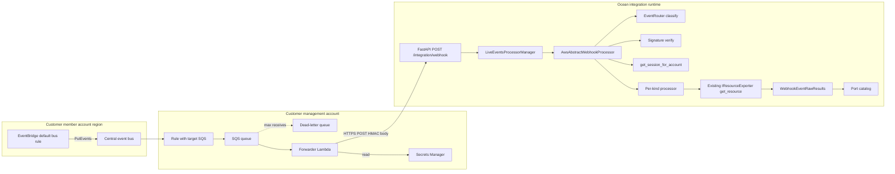

# ADR: AWS-V3 Live Events Support

| Field         | Value                                            |
|---------------|--------------------------------------------------|
| Status        | Accepted                                         |
| Date          | 2026-05-08                                       |
| Owner         | AWS-V3 integration maintainers                   |
| Scope         | `integrations/aws-v3/`                           |
| Supersedes    | —                                                |
| Related       | `integrations/github/` (webhook reference), `docs/live-events-code-flow.md` |

---

## 1. Context & problem statement

The AWS-V3 integration is today a pure poll-based exporter. Every resync run, scheduled by Port,
performs a full fan-out: account × region × resource-kind. The orchestration lives in
[`integrations/aws-v3/main.py`](../main.py) (the `@ocean.on_resync` handlers) and
[`integrations/aws-v3/resync.py`](../resync.py) (the `ResyncAWSService` facade and the
`RegionalResyncStrategy` / `GlobalResyncStrategy` classes).

For customers running tens of accounts, dozens of regions, and many supported kinds, this means:

- **Latency**: a state change in AWS (a deployment, a scaling event, a security-group flip,
  a bucket creation) is reflected in Port only on the next polling tick — typically minutes,
  sometimes longer.
- **Cost**: every tick re-describes resources that did not change; AWS API call volume scales
  with `accounts × regions × kinds` regardless of churn.
- **UX**: teams often want the catalog to track AWS changes within seconds; polling alone
  cannot do that at scale.

This ADR adopts an **additive** event-driven update path next to resync. Resync stays
authoritative for completeness and drift correction; live events improve **freshness** when
supported events fire.

## 2. Current limitations

The poll-based design is a poor fit **as the only** path for sub-minute updates:

- `_MAX_CONCURRENT_REGIONS` / `_MAX_CONCURRENT_ACCOUNTS` in [`resync.py`](../resync.py) cap
  batch fan-out; single events already carry `account` and `region` in the EB envelope.
- `ResyncAWSService.__aiter__` depends on Port resync context. Webhook handlers use
  `LiveEventsProcessorManager`'s HTTP context instead
  ([`processor_manager.py`](../../../port_ocean/core/handlers/webhook/processor_manager.py)),
  so the same iterator cannot drive live delivery.
- Live sessions reuse `AccountStrategyFactory._cached_strategy`, but lookups are by **role ARN**
  on the strategy. Webhooks need **`account_id → AioSession`**; that mapping is implemented
  in [`get_session_for_account`](../aws/auth/session_factory.py) without a second auth path.
- [`.port/spec.yaml`](../.port/spec.yaml) sets `saas.liveEvents.enabled: true` and optional
  `webhookSecret` for HMAC verification of inbound webhooks.

## 3. Goals & non-goals

**Goals**

- Reflect AWS resource changes in Port within seconds of them occurring.
- Support multi-account (Organizations and standalone) and multi-region setups end-to-end.
- Reuse the existing `IResourceExporter.get_resource(...)` contract — events are triggers,
  the exporter remains the source of truth.
- Validate inbound webhook authenticity with a signed-secret scheme.
- Be idempotent: redelivered events do not duplicate or corrupt entities.
- Be operable: structured logs, clear failure modes, easy install (CFN template).
- Be extensible: adding a new resource kind = one new processor file + one new entry in
  the routing table.

**Non-goals (this ADR)**

- Replacing or rewriting resync.
- Fan-out optimisations to resync (e.g. delta resync) — orthogonal, future work.
- New exporters or new resource kinds — separate ADRs.
- Replay-protection via timestamp + nonce, dual-secret rotation, per-resource live-events
  selectors — explicitly deferred (see §14).

## 4. Architecture options considered

| Dimension          | A: EB → SQS+DLQ → Lambda → Ocean (HMAC) | B: EB → API Destination → Ocean | C: CloudTrail → S3 → SNS → SQS → poller | D: AWS Config → SNS → Lambda → Ocean |
|--------------------|------------------------------------------|----------------------------------|------------------------------------------|---------------------------------------|
| **Mechanism**      | Service-native EB events + CT-via-EB; queued; HMAC-signed forwarder. | Service-native EB events + CT-via-EB; EB does HTTPS POST directly. | Org trail to central S3; S3 notifications drive a poller. | Config configuration items via SNS; Lambda forwards. |
| **Latency**        | 1 – 5 s end-to-end                       | 1 – 2 s end-to-end               | 5 – 15 minutes (CT delivery)             | ~10 minutes (Config recording cadence) |
| **Coverage**       | Anything in EB service-event catalog + any CT-emitting API | Same as A                        | Anything ever called via the AWS APIs    | Only Config-supported resource types  |
| **Reliability**    | Strong: SQS retries, DLQ, Lambda retries, Ocean retry on `RetryableError` | EB retries to API destinations up to 24 h, but no DLQ visibility into the body | Very strong (S3 + SNS + SQS)             | Strong (SNS + Lambda)                 |
| **Customer burden**| One CFN StackSet (org-managed) or per-account stack | Lower: no Lambda, no SQS         | Heavy: org trail, S3, SNS, SQS, IAM      | Heavy: Config recording, IAM, expensive |
| **Multi-account / region** | Native via EB cross-account rules + per-region rules | Native, but needs an API Destination per region | Native via Organizations trail           | Native via Config aggregator          |
| **Cost**           | Low: ~$1/M EB + ~$0.40/M SQS + Lambda invocations | Cheapest                         | High (CT data events, S3 storage)        | High ($0.003 per CI at scale)         |
| **Security**       | HMAC-SHA256 over body, secret in Secrets Manager, least-priv IAM per layer | API-key / basic / OAuth header only — no body HMAC | SigV4 + bucket policy                    | SNS topic policy + IAM                |

## 5. Tradeoff analysis

- **Latency** rules out C and D for the freshness goal; both deliver minutes after the fact.
- **Security** rules out **B as the default**: EventBridge API Destinations authenticate with
  API-key, basic, or OAuth headers — **not** an HMAC over the POST body — so parity with our
  GitHub-style verification is weaker. Document B only as an optional lite path for teams
  that accept that trade.
- **Reuse of IAM trust**: Option A stacks member rules + `PutEvents` onto the trust model
  already used for exporter role assumption (`aws/auth/strategies/`); no parallel secrets
  channel beyond the webhook secret Ocean already stores.
- **Cost shape:** Lambda invocations and refetch traffic grow with **churn**, not with a full
  `accounts × regions × kinds` sweep each tick.
- **Reliability** of A is strictly stronger than B because of the SQS+DLQ buffer between
  AWS and Ocean: an Ocean restart during a burst does not lose events.

## 6. Chosen architecture

**Option A — EventBridge → cross-account central bus → SQS + DLQ → Forwarder Lambda → Ocean
webhook (HMAC-SHA256)**.

Justification:

1. Hits the assessment target: updates in seconds rather than resync-interval minutes.
2. HMAC over the raw body aligns with Ocean’s `AbstractWebhookProcessor` pattern used by GitHub
   ([`_GithubAbstractWebhookProcessor`](../../github/github/webhook/webhook_processors/github_abstract_webhook_processor.py)),
   without adding mTLS.
3. SQS+DLQ provides durability, retries, and visibility-timeout-based redrive without us
   inventing an internal queue.
4. The forwarder Lambda is the *only* customer-side custom code; everything else is plain
   IAM, EventBridge rules, and SQS — all manageable by CloudFormation StackSets.
5. The implementation slots cleanly into the existing `IResourceExporter.get_resource(...)`
   contract: the Lambda forwards the EventBridge envelope verbatim; per-kind processors on
   the Ocean side extract identifiers and call the exporter for authoritative state.

## 7. Event flow end-to-end



## 8. Security approach

- **Authenticity**: Inbound requests carry `X-Port-Signature: sha256=<hex>` where `<hex>`
  is HMAC-SHA256 of the **raw** body with `webhookSecret`. Verification uses
  `hmac.compare_digest`. Same idea as GitHub’s
  [`_GithubAbstractWebhookProcessor._verify_webhook_signature`](../../github/github/webhook/webhook_processors/github_abstract_webhook_processor.py).
- **Secret storage**: the customer stores `webhookSecret` in AWS Secrets Manager in the
  management account; the forwarder Lambda fetches it once at cold start and caches it for
  the lifetime of the execution environment. Ocean stores the same value in integration
  config with `sensitive: true` so Ocean masks it in logs.
- **Transport**: HTTPS only; the Ocean SaaS endpoint is TLS-terminated upstream.
- **IAM, least privilege**:
  - Member-account stack: an IAM role allowed to call `events:PutEvents` on the
    central bus ARN — no read access to resources, no other actions.
  - Management-account stack: the forwarder Lambda is granted
    `sqs:ReceiveMessage|DeleteMessage|GetQueueAttributes` on the queue and
    `secretsmanager:GetSecretValue` scoped to the single secret ARN. Nothing else.
  - Ocean-side: no new IAM. Existing `accountRoleArn(s)` are already sufficient for the
    refetch path because the same exporters are reused.
- **No PII**: AWS resource events are not expected to contain application payloads. We avoid logging event bodies and log only routing metadata.; we explicitly do not log event
  payload bodies, only structured metadata (see §13).

## 9. Idempotency strategy

Three layers, in order of cost:

1. **Per-mapping short-circuit** in `AwsAbstractWebhookProcessor`: a process-local dict keyed on
   **EventBridge ``event[\"id\"]`` plus a fingerprint of the Port ``ResourceConfig``** (mapping,
   selector, etc.), with **10-minute TTL** (pruned on insert), **max size** cap, and entries
   recorded **only after** `handle_event` completes without throwing (retries therefore are not
   misclassified). A duplicate delivery for the same mapping returns empty
   `WebhookEventRawResults` and logs `outcome=skipped:duplicate`. Separate mappings for the
   same webhook each run once; identical refetch inputs optionally share cached raw exporter
   output to avoid redundant AWS calls. Not shared across Ocean replicas; layers 2–3 still
   correct mistakes.
2. **Refetch-then-upsert** as authoritative: on UPSERT, the processor calls
   `{Kind}Exporter.get_resource(SingleXRequest(...))` and emits whatever AWS reports as
   current. If two events arrive out of order, the latest refetch wins.
   `ResourceNotFoundException` on an UPSERT refetch is converted to a DELETE
   (using `is_resource_not_found_exception` from
   [`aws/core/helpers/utils.py`](../aws/core/helpers/utils.py)).
3. **Port catalog upsert is idempotent** by `(blueprint, identifier)`. Even if layers 1
   and 2 both fail to de-duplicate, Port will not create duplicate entities.

For DELETE events, the processor does **not** refetch. It emits
`WebhookEventRawResults(deleted_raw_results=[stub])` where `stub` is the minimal
`{Type, Properties: {<id_field>: ...}, __ExtraContext: {AccountId, Region}}` envelope
matching the JQ `identifier` in
[`.port/resources/port-app-config.yml`](../.port/resources/port-app-config.yml).

## 10. Scalability considerations

- **Throughput**: Bursts (e.g. scale-out, many ECS services, bulk Lambda updates) land in
  SQS first. The forwarder Lambda can batch (`BatchSize` / batching window per template).
- **Worker pool:** Ocean’s `LiveEventsProcessorManager` uses `config.event_workers_count`
  coroutines per path. This integration does **not** add its own queue or worker pool beyond
  that.
- **No shared state with resync:** Webhook code does not use `ResyncAWSService` and must not
  call `clear_aws_account_sessions()`. It reads the cached strategy / `get_session_for_account`
  only.
- **Backpressure**: SQS visibility timeout > forwarder Lambda timeout > Ocean per-event
  budget. Recommended values: 5 min / 1 min / 30 s (the last one matches Ocean's
  `_max_event_processing_seconds`).

## 11. Supported resource kinds & event mapping

This is the v1 mapping. Each entry below is the contract that
`aws/webhook/events.py` and `aws/webhook/routing/event_router.py` will encode.

| Kind                       | Source     | `detail-type`                                  | Identifier path                                                                  | Action classification                                                                            |
|----------------------------|------------|------------------------------------------------|----------------------------------------------------------------------------------|--------------------------------------------------------------------------------------------------|
| `AWS::EC2::Instance`       | `aws.ec2`  | `EC2 Instance State-change Notification`       | `detail.instance-id`                                                             | `pending` / `running` / `stopping` / `stopped` → UPSERT; `shutting-down` / `terminated` → DELETE |
| `AWS::EC2::Instance`       | `aws.ec2`  | `AWS API Call via CloudTrail` (`RunInstances`) | `detail.responseElements.instancesSet.items[*].instanceId` (multi-id allowed)    | UPSERT                                                                                           |
| `AWS::ECS::Service`        | `aws.ecs`  | `ECS Service Action`, `ECS Deployment State Change` | Service ARN from top-level `resources[0]` (router uses ARN string)              | UPSERT                                                                                           |
| `AWS::ECS::Service`        | `aws.ecs`  | `AWS API Call via CloudTrail` (`DeleteService`) | `detail.requestParameters.service` + `detail.requestParameters.cluster`          | DELETE                                                                                           |
| `AWS::Lambda::Function`    | `aws.lambda` | `AWS API Call via CloudTrail` (`CreateFunction20150331`, `UpdateFunctionConfiguration20150331`, `UpdateFunctionCode20150331`) | `detail.requestParameters.functionName` | UPSERT |
| `AWS::Lambda::Function`    | `aws.lambda` | `AWS API Call via CloudTrail` (`DeleteFunction20150331`) | `detail.requestParameters.functionName`                                          | DELETE                                                                                           |
| `AWS::S3::Bucket`          | `aws.s3`   | `AWS API Call via CloudTrail` (`CreateBucket`) | `detail.requestParameters.bucketName`                                            | UPSERT                                                                                           |
| `AWS::S3::Bucket`          | `aws.s3`   | `AWS API Call via CloudTrail` (`DeleteBucket`) | `detail.requestParameters.bucketName`                                            | DELETE                                                                                           |

**Out of scope for v1** (logged as `outcome=skipped:unknown_kind`, resync converges):
EKS, RDS, SQS, ECR, EBS volumes, ECS clusters / task definitions, Organizations accounts.
Each of these has the same template available — adding them is a future PR per kind.

**Coverage caveats**

- Lambda has no service-native EB events, so we rely entirely on CloudTrail-via-EB.
  Customers must enable a multi-region trail (or the org trail) for Lambda updates to be
  delivered to EventBridge.
- S3 is global; the `region` field in the EB envelope is the bucket's home region. The
  existing `S3BucketExporter` is `regional=False` and accepts any region in the
  `SingleBucketRequest`, so refetch works.


## 12. Required customer infrastructure

The customer setup is codified as two CloudFormation templates under
`examples/cloudformation/`. The detailed operator walkthrough lives in
`docs/live-events-setup.md`, but the required infrastructure is summarized here.

### 12.1 Ocean configuration

In Port/Ocean, the customer configures:

- `webhookSecret`: shared secret used to validate `X-Port-Signature`
- live events enabled through `.port/spec.yaml`
- Ocean webhook endpoint: `https://<ocean-host>/integration/webhook`

The forwarder Lambda signs the raw EventBridge event body with the same secret:

```text
X-Port-Signature: sha256=<hmac_sha256>
````

### 12.2 Management account stack

Deploy once in the customer management account.

Template:

```text
examples/cloudformation/live-events-management-account.yml
```

Provisioned resources:

* Custom EventBridge bus used as the central live-events bus
* EventBridge rule that routes matching events from the central bus to SQS
* SQS queue for buffering live events
* SQS DLQ for failed events
* Forwarder Lambda subscribed to the queue
* Secrets Manager secret containing `webhookSecret`
* IAM execution role for the Lambda

IAM permissions:

* Lambda can read/delete messages from the live-events SQS queue
* Lambda can read the webhook secret from Secrets Manager
* Lambda can write logs to CloudWatch
* No AWS resource read permissions are added here; Ocean continues to use the existing AWS-V3 read roles for exporter refetches

### 12.3 Member account / region stack

Deploy once per member account and region, or use StackSets for AWS Organizations.

Template:

```text
examples/cloudformation/live-events-member-account.yml
```

Provisioned resources:

* EventBridge rule on the default event bus
* IAM role allowing EventBridge to call `events:PutEvents` on the central management-account bus

The EventBridge rule matches the supported live-event sources:

* `aws.ec2`
* `aws.ecs`
* `aws.lambda`
* `aws.s3`

For API-backed events, the rule also matches:

```text
detail-type = AWS API Call via CloudTrail
```

and filters the required event names such as:

* `RunInstances`
* `DeleteService`
* `CreateFunction20150331`
* `UpdateFunctionCode20150331`
* `UpdateFunctionConfiguration20150331`
* `DeleteFunction20150331`
* `CreateBucket`
* `DeleteBucket`

IAM permissions:

* EventBridge can call `events:PutEvents` only on the configured central event bus ARN
* No resource read permissions are granted in the member stack
* Resource reads still happen through the existing AWS-V3 integration roles during exporter refetch

### 12.4 Multi-account and multi-region setup

For AWS Organizations, deploy the member stack with CloudFormation StackSets across the required accounts and regions.

For standalone accounts, deploy the member stack manually in each account and region that should publish live events.

EventBridge does not automatically forward events across regions, so the member stack must be deployed in every region where live events are needed.

### 12.5 Fallback behavior

If live-event infrastructure is not deployed, or if an unsupported event is received, the existing scheduled resync path still converges the catalog.

This means live events improve freshness, but resync remains the fallback for completeness and drift correction.


## 13. Operational considerations

**Structured log schema** (every line in the live-events code path):

| Field         | Source                                                                                   |
|---------------|------------------------------------------------------------------------------------------|
| `kind`        | `ObjectKind` produced by `EventRouter.classify`                                          |
| `region`      | EventBridge envelope `event["region"]`                                                   |
| `account_id`  | EventBridge envelope `event["account"]`                                                  |
| `detail_type` | `event["detail-type"]`                                                                   |
| `event_id`    | `event["id"]`                                                                            |
| `trace_id`    | Ocean's `WebhookEvent.trace_id`                                                          |
| `outcome`     | `upserted` / `deleted` / `skipped:duplicate` / `skipped:region_denied` / `skipped:account_not_onboarded` / `skipped:unknown_kind` / `error:access_denied` / `error:not_found_treated_as_delete` |

The abstract processor uses `loguru.logger.contextualize(...)` in `before_processing` so
that nested logs inherit the context (matching the pattern already used by
`LiveEventsProcessorManager` for `worker`, `webhook_path`, `trace_id`).

**Failure modes**

- DLQ depth alarm on the customer side (CloudWatch alarm in the mgmt-account stack).
- Ocean-side: `outcome=error:*` lines are sufficient for log-derived alerting; a future
  iteration may emit Ocean metrics if/when the framework exposes a hook.

**Health**

- The first webhook before any resync triggers the `AccountStrategyFactory.create() →
  healthcheck()` path. This is acceptable on cold start; a warm-up resync is recommended
  but not required.

## 14. Future extensibility

- **New resource kind**: drop a new file in `aws/webhook/processors/`, declare `_kind` and
  `_exporter_cls`, and add one entry per `(detail-type, action)` pair in
  `aws/webhook/events.py`. No other surface area changes.
- **Per-resource live-events selector** (`liveEventsEnabled` on `AWSResourceSelector`):
  deferred. Customers can opt out at the EventBridge rule level today, which is the
  right operational seam.
- **Replay protection** via `X-Port-Timestamp` and `(timestamp, body)` HMAC: deferred to
  a follow-up ADR. The current `webhookSecret` provides authenticity; the threat model
  for replay attacks against an idempotent upsert pipeline is low.
- **Dual-secret rotation** (`webhookSecret` + `webhookSecretPrevious`): deferred. Today's
  rotation is a coordinated update of Ocean config and Secrets Manager.
- **Per-replica idempotency cache** unified across an Ocean cluster: not required
  because Port-side `(blueprint, identifier)` upsert is the ultimate de-dup. Revisit if
  the framework gains a shared cache provider for live events.
- **Direct API Destination ("lite") install option**: documented as Option B and
  available for customers who accept API-key-only authenticity.
