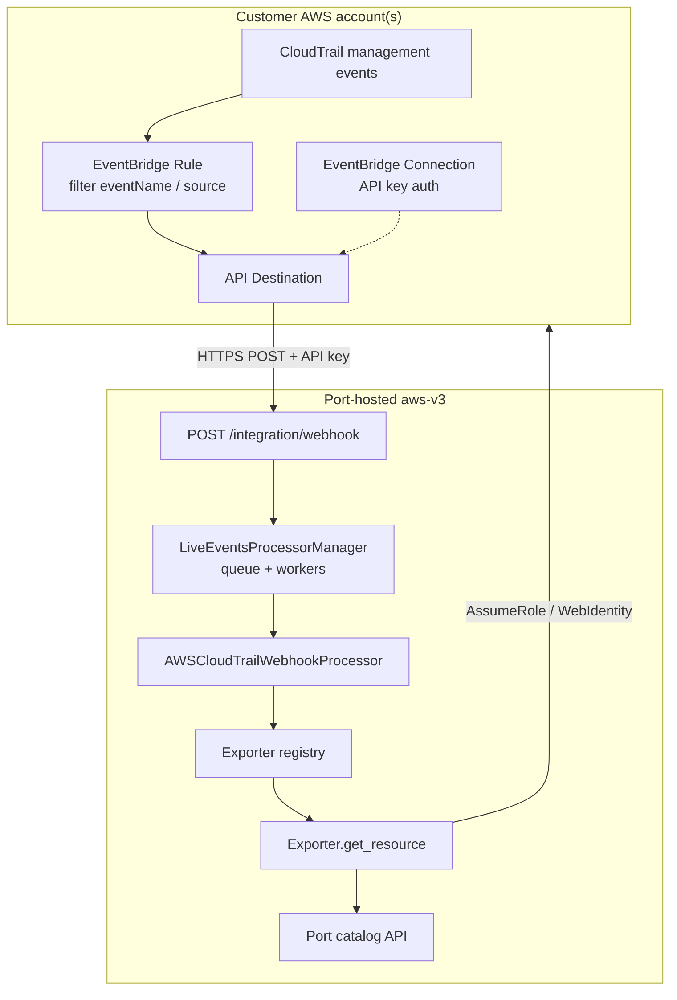

# AWS-v3 Live Events — Project Brief

> **Status:** Planning
> **Integration:** `aws-v3` (AWS Hosted by Port)
> **Approach:** CloudTrail → EventBridge API Destination → Port webhook (recommended)
> **Last updated:** 2026-07-23
> **v1 estimate:** 6–8 weeks (1 engineer) · 4–5 weeks (2 engineers)

---

## Why this project is needed

### Problem

**aws-v3 is resync-only today** (`saas.liveEvents.enabled: false`). Resource changes in AWS are not reflected in Port until the next scheduled resync.

This causes:

- **Catalog drift** between resyncs
- **Slower change visibility** for engineering teams
- **Parity gap** with legacy self-hosted `aws`, which already supports live updates via webhook

### Goal

Enable **near-real-time** create / update / delete in Port for aws-v3, without requiring customers to self-host Ocean.

### Success criteria

- Customer deploys AWS-side event plumbing (per account or via StackSet)
- Port aws-v3 receives change signals, **re-fetches authoritative state** from AWS, updates the catalog
- Multi-account auth (Organizations, OUs, explicit role ARNs) works on the live path
- Authentication and idempotency are production-grade
- v1 kinds covered end-to-end with IaC templates and operator docs

---


### Design principles

1. **Reuse exporters** — live path calls existing `Exporter.get_resource()`, same as resync
2. **Ocean processor framework** — `AbstractWebhookProcessor`, not legacy `@ocean.router.post`
3. **Small normalized contract** — parse CloudTrail early into `{ kind, identifier, account_id, region, action }`
4. **Customer IaC** — Port provides templates; customer deploys in their AWS accounts
5. **Same auth as resync** — `get_session_for_account(account_id)` using existing strategies

### End-to-end flow



**Key idea:** the webhook is a **signal only**. The integration always re-fetches current state from AWS, then registers or unregisters in Port.

### Why API Destination (not SNS)

| | API Destination (chosen) | SNS → HTTPS (deferred) |
|--|---------------------------|-------------------------|
| Hops | EventBridge → Port directly | EventBridge → SNS → Port |
| Payload | CloudTrail event (transformable) | SNS envelope + inner JSON |
| Setup | Connection + Destination + Rule | Topic + subscription + **confirmation per endpoint** |
| Auth | API key on Connection (legacy parity) | SNS signature + optional custom HMAC |
| Reference | EventBridge Connections docs | Open PR #3191 approach |

**SNS remains a fallback** if API Destination limits (payload size, retry semantics, org policy) block rollout.

### Authentication

Use **`liveEventsApiKey`** (same concept as legacy `aws`):

- Customer configures key in Port integration settings
- EventBridge **Connection** sends header `x-port-aws-ocean-api-key`
- Processor `authenticate()` compares against `ocean.integration_config.get("live_events_api_key")`

### API Destination auth (no OPTIONS handshake)

**EventBridge API Destinations do not require an OPTIONS pre-flight handshake** to your endpoint.

Auth works via an EventBridge **Connection** (created in the customer AWS account):

1. Customer creates a Connection with **API key** auth (`x-port-aws-ocean-api-key` + `liveEventsApiKey` value)
2. AWS validates the Connection internally and moves it to `AUTHORIZED`
3. When a rule fires, EventBridge **POSTs** the event to the API Destination URL with the Connection credentials attached

No subscription confirmation (unlike SNS) and no CloudEvents `WebHook-Allowed-*` response (unlike Azure Event Grid).

Port-side auth is only: validate the API key on incoming **POST** requests in `AbstractWebhookProcessor.authenticate()`.

---

## Port-side implementation

### Proposed file layout

```
integrations/aws-v3/
  aws/
    events/
      __init__.py
      registry.py              # kind → exporter + single-resource request factory
      cloudtrail_parser.py     # CloudTrail payload → NormalizedEvent
      webhook_processor.py     # AbstractWebhookProcessor
    auth/
      session_factory.py       # + get_session_for_account(account_id)
  templates/
    live-events.yaml           # per-account CloudFormation
    live-events-stackset.yaml  # optional org-wide deployment
  docs/
    live-events-setup.md       # operator guide
    live-events-project.md     # this file
  tests/
    events/
      test_cloudtrail_parser.py
      test_webhook_processor.py
      test_registry.py
```

### Core components

#### 1. Exporter registry

Resync uses hardcoded handlers in `main.py`. Live events need a lookup table:

```python
@dataclass(frozen=True)
class ExporterBinding:
    exporter_cls: type[IResourceExporter]
    request_factory: Callable[..., ResourceRequestModel]

REGISTRY: dict[str, ExporterBinding] = {
    ObjectKind.EC2_INSTANCE: ExporterBinding(EC2InstanceExporter, PaginatedEC2InstanceRequest),
    ObjectKind.S3_BUCKET: ExporterBinding(S3BucketExporter, SingleBucketRequest),
    # one entry per supported kind
}
```

#### 2. CloudTrail parser

```python
@dataclass
class NormalizedEvent:
    kind: str
    identifier: str
    account_id: str
    region: str
    action: Literal["upsert", "delete"]

def parse_cloudtrail(payload: dict) -> NormalizedEvent | None:
    ...
```

Map `detail.eventName` → kind + ID extraction from `requestParameters` / `responseElements`.

#### 3. Single webhook processor (v1)

One `AWSCloudTrailWebhookProcessor` with a parser table — split per-kind processors only if parsers grow too large.

Responsibilities:

- `authenticate()` — API key header
- `should_process_event()` — parser returns non-None
- `get_matching_kinds()` — from normalized event
- `handle_event()` — session → exporter → `WebhookEventRawResults`
- Respect **region policy** and port-app-config (kind enabled, region allowed)

#### 4. Registration in `main.py`

```python
ocean.add_webhook_processor("/webhook", AWSCloudTrailWebhookProcessor)
```

#### 5. Dedupe

- **v1:** in-memory TTL on `(account_id, kind, identifier, event_id)`
- **v2 (SaaS multi-pod):** Redis or rely on Port upsert idempotency (weaker)

---

## Customer AWS architecture

### Per-account deployment (default)

Each account that should emit live events needs:

| Component | Purpose |
|-----------|---------|
| CloudTrail | Management events (if not already org-wide) |
| EventBridge rule(s) | Match relevant `eventName` / `source` |
| EventBridge Connection | API key auth to Port |
| API Destination | HTTPS target = Port webhook URL |
| IAM role | EventBridge permission to invoke API Destination |

```
Account A: Rule → API Destination → Port
Account B: Rule → API Destination → Port
Account N: ...
```

- **Same Port webhook URL** for all accounts
- **EventBridge rules are per account** (default event bus is per account)
- **Read IAM roles** already required for resync — reused on live path
- Events must include **account ID** and **region** (CloudTrail provides both)

### Scale: CloudFormation StackSet

For organizations with many accounts, document a **StackSet** that deploys `live-events.yaml` to all target OUs/accounts. Still per-account resources, but one operational action.

### Alternative: centralized org trail

Mature customers may use:

```
Organization CloudTrail trail
  → EventBridge on management / security account
  → rules matching events from all member accounts (detail.account)
  → single API Destination → Port
```

Fewer delivery endpoints, but requires org admin, careful rule design, and Port still assumes into the **member account** from the event.

**Port does not auto-deploy any of this** — templates + docs only.

---

## Multi-account alignment with aws-v3 auth

| aws-v3 resync mode | Live events implication |
|--------------------|-------------------------|
| **Organizations** (`accountRoleArn`) | StackSet to all discovered accounts, or central org trail |
| **OU-scoped** (`ouId`) | Deploy events only for accounts under those OUs |
| **Explicit** (`accountRoleArns`) | Event rules for each listed account only |

Resync discovers accounts automatically. **Live events do not** — customer must deploy forwarding per account (or central trail).

### Live path requirements

- [ ] Resolve session for `account_id` from event (not only home account)
- [ ] Apply region policy from port-app-config
- [ ] Skip / unregister when `get_resource()` returns empty (delete)
- [ ] Access denied → log + return 200 (avoid infinite EventBridge retries)
- [ ] Dedupe duplicate deliveries

---

## v1 resource scope

Start with kinds that have straightforward CloudTrail `eventName` → identifier mapping:

| Kind | Example CloudTrail events |
|------|---------------------------|
| `AWS::EC2::Instance` | `RunInstances`, `TerminateInstances`, `StopInstances` |
| `AWS::S3::Bucket` | `CreateBucket`, `DeleteBucket` |
| `AWS::Lambda::Function` | `CreateFunction`, `DeleteFunction`, `UpdateFunctionConfiguration` |
| `AWS::ECS::Service` | `CreateService`, `DeleteService`, `UpdateService` |

Expand in later phases: RDS, EKS, ECR, CodePipeline, CodeBuild, etc.

---

## Phased rollout

| Phase | Deliverables | Estimate |
|-------|----------------|----------|
| **v1** | EC2, S3, Lambda, ECS Service + API Destination template + processor + tests | **6–8 weeks** (1 engineer) / **4–5 weeks** (2 engineers) |
| **v2** | RDS, EKS, ECR + StackSet template + setup docs | **3–4 weeks** |
| **v3** | CodePipeline / CodeBuild (complex identifiers) | **4–6 weeks** |
| **v4** | Central org-bus template, durable dedupe for multi-pod SaaS | **2–3 weeks** |

**Full program (v1–v4):** ~15–21 weeks sequential, or ~10–14 weeks with overlap after v1 ships.

---

## Comparison with legacy `aws`

| | Legacy `aws` | aws-v3 (this project) |
|--|--------------|----------------------|
| Hosting | Customer ECS + ALB | Port SaaS |
| Handler | Direct `@ocean.router.post` | `AbstractWebhookProcessor` |
| Customer delivery | API Destination (typical) | API Destination (same) |
| Auth | `liveEventsApiKey` | `liveEventsApiKey` |
| Fetch | `describe_single_resource()` | `Exporter.get_resource()` |
| Multi-account | `organizationRoleArn` + role name | Org / OU / `accountRoleArns` |
| Resource breadth | Cloud Control generic | Curated per exporter |

---

## Project tasks

Estimates assume **1 senior engineer** familiar with aws-v3 and Ocean. Ranges account for platform coordination and E2E AWS setup. Tasks within a section can run in parallel where noted.

### Summary (v1 only)

| Section | Estimate |
|---------|----------|
| 0. Decisions & spike | 4–6 days |
| 1. Configuration & platform | 2–3 days |
| 2. Port-side core | 10–14 days |
| 3. Customer IaC & docs | 8–11 days |
| 4. Testing | 7–10 days (overlaps §2) |
| 5. End-to-end validation | 5–7 days |
| 6. Release | 3–4 days |
| **v1 total (calendar)** | **~6–8 weeks** |

---

### 0. Decisions & spike — **4–6 days**

- [ ] Confirm Port platform can enable `saas.liveEvents.enabled: true` for aws-v3 — **1–2 days** *(platform coordination)*
- [ ] Confirm hosted webhook URL pattern per installation — **1 day**
- [ ] Spike API Destination payload limits with real CloudTrail events — **2–3 days**
- [ ] Finalize v1 kind list — **0.5 day**

### 1. Configuration & platform — **2–3 days**

- [ ] Add `liveEventsApiKey` to `integrations/aws-v3/.port/spec.yaml` — **0.5 day**
- [ ] Set `saas.liveEvents.enabled: true` when platform is ready — **0.5 day** *(depends on §0)*
- [ ] Update `.env.example` — **0.5 day**
- [ ] Validate SaaS ingress (direct HTTP vs Redis stream consumer for multi-pod) — **1–2 days**

### 2. Port-side core — **10–14 days**

- [ ] `aws/events/registry.py` — exporter bindings for v1 kinds — **1–2 days**
- [ ] `aws/events/cloudtrail_parser.py` — `eventName` maps + identifier extractors — **3–5 days** *(highest risk: event shape variance per kind)*
- [ ] `aws/events/webhook_processor.py` — `AWSCloudTrailWebhookProcessor` — **3–4 days**
- [ ] `get_session_for_account(account_id)` in session factory — **1–2 days**
- [ ] Register processor in `main.py` — **0.5 day**
- [ ] Port-app-config gating (kind + region policy) — **1–2 days**
- [ ] In-memory dedupe (TTL) — **1–2 days**

### 3. Customer IaC & docs — **8–11 days**

- [ ] `templates/live-events.yaml` — Connection, API Destination, Rule, IAM per account — **3–4 days**
- [ ] `templates/live-events-stackset.yaml` — org-wide deployment — **2–3 days**
- [ ] `docs/live-events-setup.md` — step-by-step operator guide — **2–3 days**
- [ ] Document per-account vs central org trail tradeoffs — **1 day**
- [ ] Document multi-account deployment with StackSet — **1 day**
- [ ] Example EventBridge event patterns per v1 kind — **1 day**

### 4. Testing — **7–10 days** *(start after parser + processor stubs; overlaps §2)*

- [ ] Unit: CloudTrail parser (sample payloads per kind, upsert + delete) — **2 days**
- [ ] Unit: registry resolution — **0.5 day**
- [ ] Unit: authenticate (valid / missing / wrong key) — **0.5 day**
- [ ] Unit: processor with mocked exporter + session — **1–2 days**
- [ ] Unit: region policy rejection — **0.5 day**
- [ ] Unit: dedupe behavior — **1 day**
- [ ] Integration: webhook POST → Port entity create / update / delete — **2–3 days**
- [ ] Integration: event from member account B, integration credentialed for org — **1–2 days**
- [ ] Negative: unknown kind, access denied, malformed payload — **1 day**

### 5. End-to-end validation — **5–7 days**

- [ ] Deploy aws-v3 with live events in test Port org — **1 day**
- [ ] Deploy IaC in ≥2 AWS accounts — **1–2 days**
- [ ] Create / update / delete without waiting for resync — **2 days**
- [ ] Verify scheduled resync still works — **0.5 day**
- [ ] Verify EventBridge Connection reaches `AUTHORIZED` and POST deliveries succeed — **1 day**

### 6. Release — **3–4 days**

- [ ] CHANGELOG entry + version bump in `pyproject.toml` — **0.5 day**
- [ ] Port docs site page for aws-v3 live events installation — **1–2 days**
- [ ] Beta rollout plan for existing customers — **1 day**
- [ ] Support runbook: connection failures, auth errors, missing entities, throttling — **1 day**

### 7. Follow-ups (post-v1)

| Task | Estimate |
|------|----------|
| Expand registry to full aws-v3 resync catalog | **2–3 weeks** |
| SNS delivery path (only if API Destination insufficient) | **1–2 weeks** |
| Durable dedupe for multi-replica SaaS | **3–5 days** |
| Rate limiting / WAF guidance for public webhook | **2–3 days** |
| Migration guide: legacy `aws` live events → aws-v3 | **2–3 days** |

---

## Open questions

3. API Destination input transformer — needed to shrink payload, or parse full CloudTrail in processor?
4. Delete detection — infer from `eventName` only, or always attempt `get_resource()` first?
5. CodePipeline / nested resources — identifier strategy for v3+

---

## References

- Legacy webhook: `integrations/aws/main.py`, `integrations/aws/utils/aws.py`
- aws-v3 exporters: `integrations/aws-v3/aws/core/exporters/**`
- Ocean live events: `port_ocean/core/handlers/webhook/processor_manager.py`
- EventBridge API Destinations: https://docs.aws.amazon.com/eventbridge/latest/userguide/eb-api-destinations.html
- CloudTrail → EventBridge: https://docs.aws.amazon.com/eventbridge/latest/userguide/cloudtrail-event-bridge.html
- Alternative explored (not chosen for v1): [PR #3191](https://github.com/port-labs/ocean/pull/3191) — SNS-based approach
