# AWS-V3 Live Events — Operator Setup Guide

This guide walks an operator end-to-end through bringing live events online
for the AWS-V3 Ocean integration: deploy the AWS-side infrastructure, wire
up the integration side, verify, and operate (rotation, DLQ replay,
monitoring, troubleshooting).

For design rationale and trade-offs, see
[`adr-live-events.md`](./adr-live-events.md).
For the CloudFormation template itself (and its inline reference docs),
see [`cloudformation/live-events.yaml`](./cloudformation/live-events.yaml).

---

## 1. What gets deployed

```
                 AWS service event
                       │
                       ▼
              EventBridge default bus
                       │
                       ▼
            EventBridge Rule  ── on failure (after retries) ──▶  SQS DLQ
                       │                                          (per rule)
                       ▼
            EventBridge API Destination
                       │  Authorization: Bearer <webhookSecret>
                       ▼
            Ocean webhook endpoint
                       │
                       ▼
            POST /integration/webhook/live-events
```

Four EventBridge rules fan into a single API Destination:

| Rule                   | Source       | Native or CT-on-EB | Region scope          |
|------------------------|--------------|--------------------|-----------------------|
| EC2 instance state     | `aws.ec2`    | Native             | Per region            |
| ECS service/deployment | `aws.ecs`    | Native             | Per region            |
| Lambda lifecycle       | `aws.lambda` | CloudTrail-on-EB   | Per region            |
| S3 bucket lifecycle    | `aws.s3`     | CloudTrail-on-EB   | **`us-east-1` only**  |

S3's control plane is global; CloudTrail surfaces those events to the
default bus only in `us-east-1`. The CloudFormation template auto-gates
the S3 rule on `IsUsEast1`, so deploying to other regions yields EC2 +
ECS + Lambda only — that's expected, not a bug.

---

## 2. Prerequisites

### 2.1 An active CloudTrail trail (Lambda + S3 only)

The Lambda and S3 rules ride on `AWS API Call via CloudTrail`. Without
an active trail capturing **management events** in the relevant region,
those events never reach the default EventBridge bus and the rules fire
zero times — silently.

- For Lambda: a trail must be active in **each region** where this stack
  is deployed.
- For S3: a trail must be active in **`us-east-1`** (the global S3
  control-plane region).

A multi-region trail satisfies both. If you don't have one:

```bash
aws cloudtrail create-trail \
    --name port-ocean-aws-trail \
    --s3-bucket-name <existing-bucket> \
    --is-multi-region-trail
aws cloudtrail start-logging --name port-ocean-aws-trail
```

Management events are sufficient. **Do not enable data events** for this
use case — they are cost-prohibitive and irrelevant.

### 2.2 A Secrets Manager secret holding the bearer token

The webhook is authenticated by a shared bearer token. Generate one and
store it in Secrets Manager so the CloudFormation stack and the
integration's config reference the same source of truth.

```bash
TOKEN="$(openssl rand -hex 32)"

aws secretsmanager create-secret \
    --name port-ocean-aws-live-events-webhook \
    --secret-string "$TOKEN"
```

Note both:

- The secret's `ARN` — passed as the `WebhookSecretArn` CFN parameter.
- The raw `$TOKEN` value — set as `webhookSecret` on the integration
  side (Section 3). Do **not** include the `Bearer ` prefix; the AWS
  side adds it via the EventBridge Connection.

### 2.3 An Ocean AWS-V3 integration with a reachable HTTPS endpoint

You need `<your-ocean-host>` resolvable from AWS over HTTPS — EventBridge
API Destinations refuse to call HTTP endpoints. The full webhook URL is
always `https://<your-ocean-host>/integration/webhook/live-events`.

---

## 3. Wire up the integration side

In your Ocean AWS-V3 integration config, set:

| Key                   | Required? | Value                                                          |
|-----------------------|-----------|----------------------------------------------------------------|
| `webhookSecret`       | Yes¹      | The raw token from §2.2 (no `Bearer ` prefix).                 |
| `allowedAccountIds`   | No²       | List of AWS account IDs whose events should be processed.      |

¹ Required if you want live events to work. When unset, every inbound
webhook request is rejected with HTTP 401 (defense in depth — see
`aws/webhook/middleware.py`).

² When unset, the allowlist is derived from the accounts that passed the
integration's auth health check. Setting it explicitly is recommended
for org-wide rollouts where the in-scope account set is static and known.
Events from accounts not in the allowlist are dropped with a structured
log line — they do **not** count toward your AWS API quota.

The integration's `spec.yaml` already declares `saas.liveEvents.enabled:
true`; no other toggles are required.

---

## 4. Deploy the AWS infrastructure

### 4.1 Single region (start here)

Always deploy `us-east-1` **first** — that's the region that owns the S3
rule. Repeat for every other region you want monitored.

```bash
aws cloudformation deploy \
    --region us-east-1 \
    --stack-name port-ocean-aws-live-events \
    --template-file integrations/aws-v3/docs/cloudformation/live-events.yaml \
    --capabilities CAPABILITY_IAM \
    --parameter-overrides \
        OceanWebhookUrl=https://<your-ocean-host>/integration/webhook/live-events \
        WebhookSecretArn=arn:aws:secretsmanager:us-east-1:<account>:secret:port-ocean-aws-live-events-webhook-XXXXXX
```

Then repeat for `eu-west-1`, `ap-southeast-1`, etc. The S3 rule is
omitted automatically in non-`us-east-1` regions; the other three rules
deploy normally.

### 4.2 Org-wide rollout via StackSets

For multi-account org-wide coverage, wrap the same template in a
CloudFormation StackSet targeting the OUs containing your member
accounts:

```bash
aws cloudformation create-stack-set \
    --stack-set-name port-ocean-aws-live-events \
    --template-body file://integrations/aws-v3/docs/cloudformation/live-events.yaml \
    --capabilities CAPABILITY_IAM \
    --permission-model SERVICE_MANAGED \
    --auto-deployment Enabled=true,RetainStacksOnAccountRemoval=false \
    --parameters \
        ParameterKey=OceanWebhookUrl,ParameterValue=https://<your-ocean-host>/integration/webhook/live-events \
        ParameterKey=WebhookSecretArn,ParameterValue=<arn-in-each-member-account>

aws cloudformation create-stack-instances \
    --stack-set-name port-ocean-aws-live-events \
    --deployment-targets OrganizationalUnitIds=ou-xxxx-yyyyyyyy \
    --regions us-east-1 eu-west-1 ap-southeast-1
```

Per-account considerations:

- The secret **must exist in every target account, in every target
  region** (Secrets Manager is regional). A simple secret-replication
  Lambda or a separate StackSet that provisions the secret is the usual
  pattern.
- Each account's events carry that account's `account` field; the
  integration uses `allowedAccountIds` (or the derived allowlist) to
  decide whether to process them.

---

## 5. Verify

### 5.1 Smoke-test the webhook endpoint (no AWS event required)

The integration exposes a healthcheck-only short-circuit triggered by
the `X-Port-Healthcheck: 1` header — it exercises auth + routing without
fetching anything from AWS:

```bash
# Expect 200 OK and an empty body
curl -i -X POST \
    -H "Authorization: Bearer $TOKEN" \
    -H "X-Port-Healthcheck: 1" \
    -H "Content-Type: application/json" \
    --data '{}' \
    https://<your-ocean-host>/integration/webhook/live-events

# Expect 401 — confirms auth is wired
curl -i -X POST \
    -H "Authorization: Bearer wrong-secret" \
    -H "X-Port-Healthcheck: 1" \
    --data '{}' \
    https://<your-ocean-host>/integration/webhook/live-events
```

If the healthcheck path fails, no real AWS event will ever succeed —
fix this before triggering the per-rule smoke tests below.

### 5.2 Per-rule smoke tests

```bash
# EC2 (native rule — usually delivers within seconds):
aws ec2 stop-instances --instance-ids i-xxxxxxxxxxxxxxxxx

# Lambda (CT-on-EB — typically 30s–2min for CloudTrail to flush):
aws lambda update-function-configuration \
    --function-name <your-test-function> \
    --timeout 30

# S3 (CT-on-EB, us-east-1 only):
aws s3api create-bucket \
    --bucket port-ocean-test-$(date +%s) \
    --region us-east-1
```

Then check the corresponding entity in Port — the `updatedAt` should
have advanced.

### 5.3 Watch the DLQs

A nonzero DLQ depth is the canonical signal that the AWS side fired
but Ocean did not accept the event (auth mismatch, Ocean down,
rate-limited, etc.):

```bash
aws cloudwatch get-metric-statistics \
    --namespace AWS/SQS \
    --metric-name ApproximateNumberOfMessagesVisible \
    --dimensions Name=QueueName,Value=port-ocean-aws-live-events-ec2-dlq \
    --start-time $(date -u -d '1 hour ago' +%Y-%m-%dT%H:%M:%S) \
    --end-time $(date -u +%Y-%m-%dT%H:%M:%S) \
    --period 300 --statistics Maximum
```

We strongly recommend a CloudWatch alarm per DLQ; the
[CloudFormation template](./cloudformation/live-events.yaml) outputs
each DLQ URL so it's easy to wire alarms in a separate stack.

---

## 6. Operational runbooks

### 6.1 Rotate the webhook bearer token

The token is referenced in **two** places: the EventBridge Connection
(via Secrets Manager) and the integration's `webhookSecret`. Naively
rotating one side first causes a flap window where every inbound webhook
is rejected with 401 and lands in the DLQs.

#### Zero-downtime rotation (recommended)

The integration's middleware compares the inbound `Bearer` against the
configured `webhookSecret` using `hmac.compare_digest` — there is no
built-in support for two simultaneously valid secrets. To rotate
without downtime, *briefly* configure the integration to accept either
secret:

1. Generate the new token:
   ```bash
   NEW_TOKEN="$(openssl rand -hex 32)"
   ```
2. Update the integration to a wrapper that accepts both tokens. (If you
   don't want a wrapper, accept a brief window of 401s and use the
   in-place procedure below.)
3. Stage the new value as a new Secrets Manager version:
   ```bash
   aws secretsmanager put-secret-value \
       --secret-id port-ocean-aws-live-events-webhook \
       --secret-string "$NEW_TOKEN"
   ```
4. Force the EventBridge Connection to pick up the new version. The
   Connection uses `{{resolve:secretsmanager:...:SecretString}}` which
   resolves at deploy time; trigger a stack update to refresh it:
   ```bash
   aws cloudformation update-stack \
       --stack-name port-ocean-aws-live-events \
       --use-previous-template \
       --capabilities CAPABILITY_IAM \
       --parameters ParameterKey=OceanWebhookUrl,UsePreviousValue=true \
                    ParameterKey=WebhookSecretArn,UsePreviousValue=true
   ```
5. Confirm a real event delivers with HTTP 200.
6. Update the integration's `webhookSecret` to the new token (drop the
   wrapper).

#### In-place rotation (brief 401 window)

If you accept ~30 seconds of failed deliveries (which get retried from
the DLQ — see §6.2):

1. `put-secret-value` to stage the new token.
2. Stack-update each region's stack to refresh the Connection.
3. Update the integration's `webhookSecret` last.
4. After confirming traffic recovers, drain the DLQs.

### 6.2 Replay the DLQ

Every DLQ message is a full EventBridge envelope wrapped in an SQS
envelope. Replay is a matter of re-issuing the original POST against
the webhook with the current bearer token.

```bash
QUEUE_URL="$(aws sqs get-queue-url \
    --queue-name port-ocean-aws-live-events-ec2-dlq \
    --query QueueUrl --output text)"

WEBHOOK="https://<your-ocean-host>/integration/webhook/live-events"
TOKEN="$(aws secretsmanager get-secret-value \
    --secret-id port-ocean-aws-live-events-webhook \
    --query SecretString --output text)"

while true; do
    MSG="$(aws sqs receive-message \
        --queue-url "$QUEUE_URL" \
        --max-number-of-messages 1 \
        --wait-time-seconds 1 \
        --query 'Messages[0]' --output json)"

    [ "$MSG" = "null" ] && break

    BODY="$(echo "$MSG" | jq -r '.Body')"
    RECEIPT="$(echo "$MSG" | jq -r '.ReceiptHandle')"

    STATUS=$(curl -s -o /dev/null -w "%{http_code}" -X POST \
        -H "Authorization: Bearer $TOKEN" \
        -H "Content-Type: application/json" \
        --data "$BODY" \
        "$WEBHOOK")

    if [ "$STATUS" = "200" ]; then
        aws sqs delete-message \
            --queue-url "$QUEUE_URL" \
            --receipt-handle "$RECEIPT"
        echo "replayed ok"
    else
        echo "replay failed: HTTP $STATUS — leaving message on queue"
        break
    fi
done
```

Run this per DLQ (`ec2-dlq`, `ecs-dlq`, `lambda-dlq`, `s3-dlq`).
Idempotency is guaranteed by Port's ARN-based entity identity — replaying
the same event twice produces no duplicate entities.

### 6.3 Disable live events temporarily

Without tearing down the stack, you can pause delivery by disabling each
rule:

```bash
for rule in \
    port-ocean-aws-live-events-ec2-instance-state \
    port-ocean-aws-live-events-ecs-service \
    port-ocean-aws-live-events-lambda-lifecycle \
    port-ocean-aws-live-events-s3-bucket-lifecycle; do
    aws events disable-rule --name "$rule" 2>/dev/null || true
done
```

Re-enable with `aws events enable-rule --name ...`. Events that fire
while disabled are **not** queued — they're dropped at the source.

### 6.4 Tear down

DLQs use `DeletionPolicy: Retain` so unprocessed events survive stack
deletion. Drain them (see §6.2) before deleting:

```bash
aws cloudformation delete-stack --stack-name port-ocean-aws-live-events

# Then, after confirming queues are empty:
aws sqs delete-queue --queue-url <ec2-dlq-url>
aws sqs delete-queue --queue-url <ecs-dlq-url>
aws sqs delete-queue --queue-url <lambda-dlq-url>
aws sqs delete-queue --queue-url <s3-dlq-url>   # us-east-1 only
```

---

## 7. Troubleshooting

| Symptom                                                  | Likely cause                                                            | Fix                                                                                       |
|----------------------------------------------------------|-------------------------------------------------------------------------|-------------------------------------------------------------------------------------------|
| Healthcheck `curl` returns 401                           | `webhookSecret` not set on the integration, or token mismatch.          | Set `webhookSecret`, restart integration. Re-test with the matching bearer.               |
| EC2 / ECS events deliver, Lambda / S3 do not             | No active CloudTrail trail in the relevant region (§2.1).               | Create a multi-region trail and `start-logging`.                                          |
| S3 events never deliver, even with CloudTrail            | Stack not deployed to `us-east-1`.                                      | Deploy a stack instance to `us-east-1` — that's the only region with the S3 rule.        |
| DLQ depth climbing during a token rotation               | Connection still resolves the old secret version.                       | Run a no-op CFN stack-update to refresh the Connection; then replay (§6.2).               |
| 100% delivery failures with HTTP 400 / "Invalid request" | Token in `.env` (dev only) has trailing `\r` from CRLF line endings.    | `sed -i 's/\r$//' .env` and restart.                                                      |
| Sustained 401s with the correct token                    | Token has `Bearer ` prefix baked into the secret.                       | The CFN Connection adds `Bearer ` itself. Strip the prefix from Secrets Manager.          |
| Events deliver but entity never updates                  | `allowedAccountIds` excludes the source account.                        | Add the account ID, or remove the override to fall back to the derived allowlist.         |
| Sporadic delivery for one kind only                      | Per-rule throttling: `InvocationRateLimitPerSecond` too low.            | Raise the parameter on a CFN update. Retries will replay from the DLQ once recovered.    |
| Lambda events fire late                                  | CloudTrail's normal 30s–5min delivery lag — not a bug.                  | Tune monitoring SLOs; this is the cost of CT-on-EB.                                       |
| Entity goes missing right after a "live" delete         | Race: AWS API returns 404 on `get_resource` after delete.               | This is expected. The handler converts 404 into a delete payload (`is_resource_not_found_exception`). |

---

## 8. Screenshots (catalog & audit)

Verification captures from Port after live events. Images live in [`images/live-events/`](./images/live-events/).

### 8.1 Catalog — creates and updates

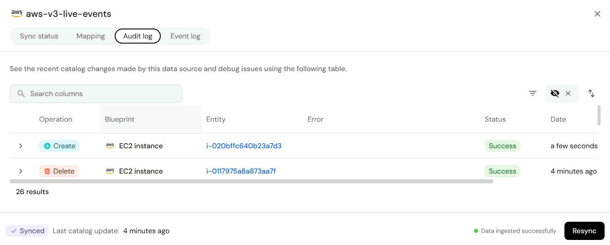

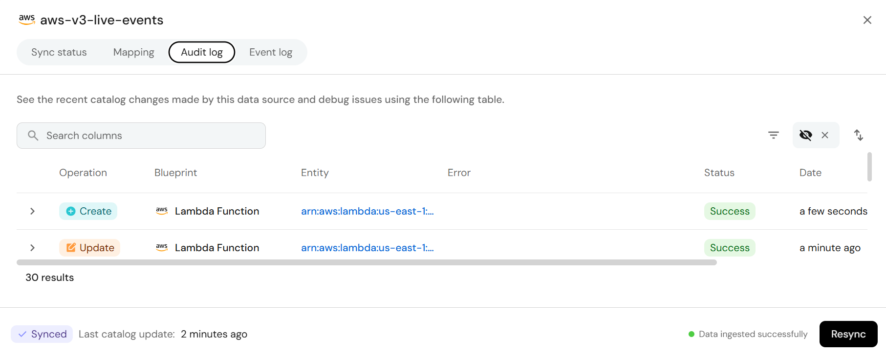

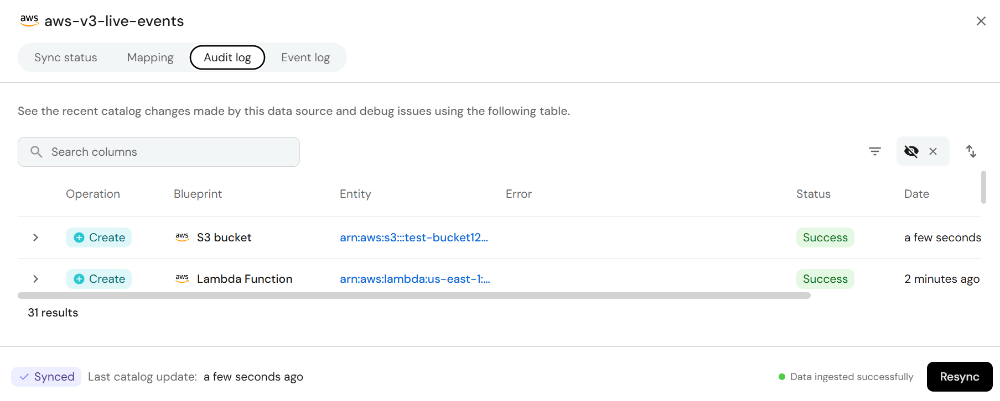

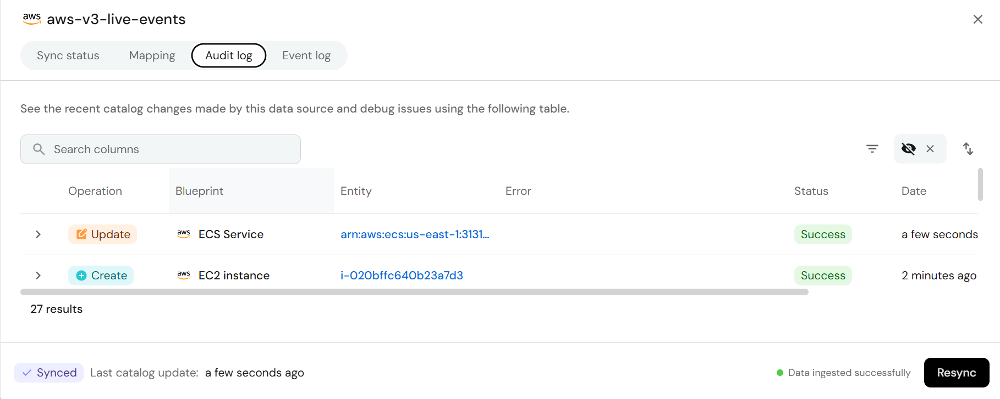

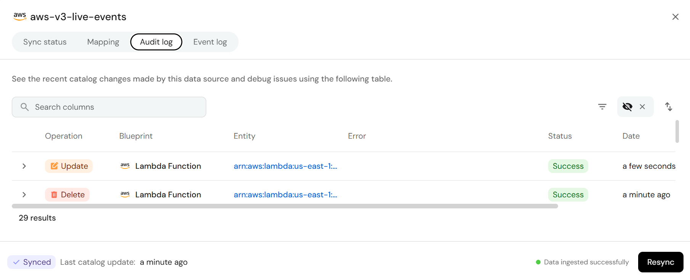

### 8.2 Catalog — deletes

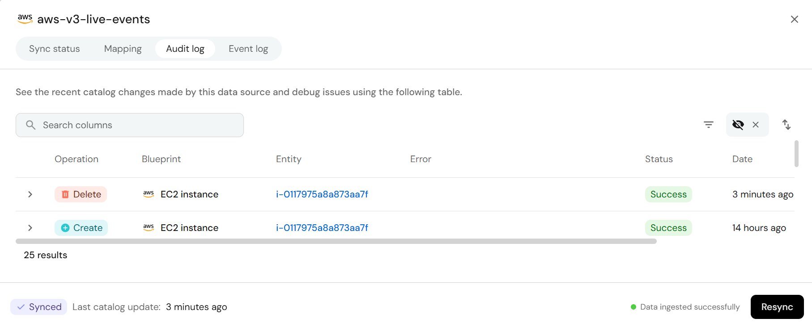

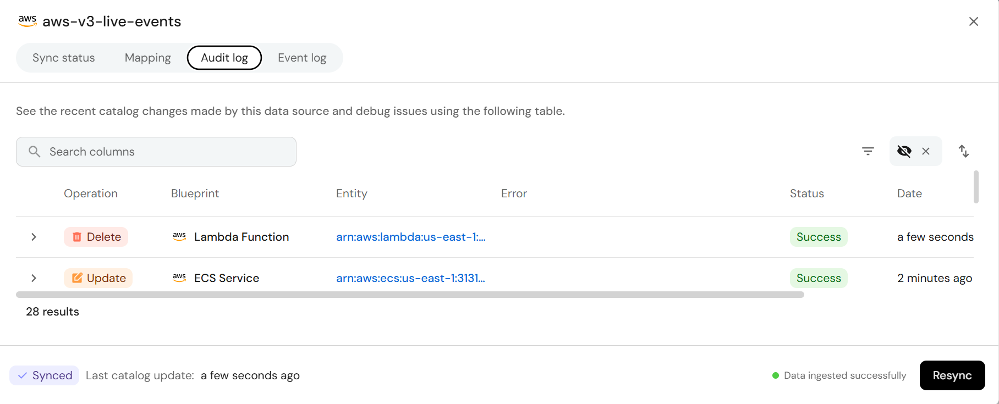

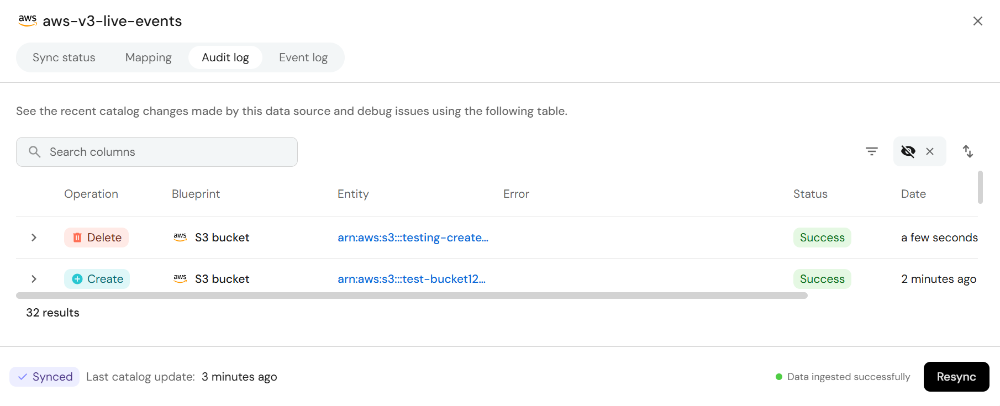

### 8.3 Audit log — live event activity

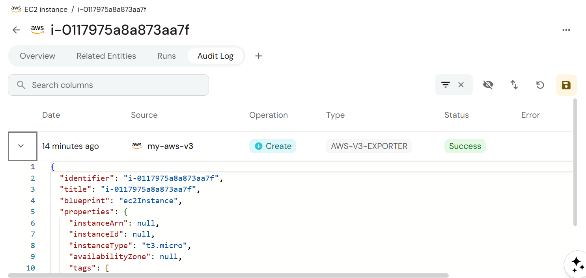

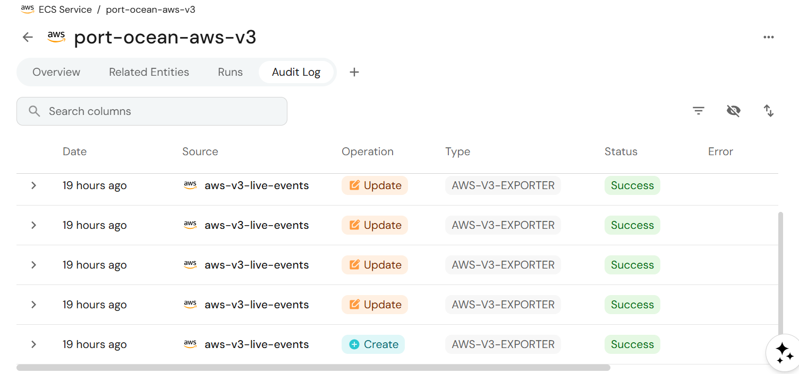

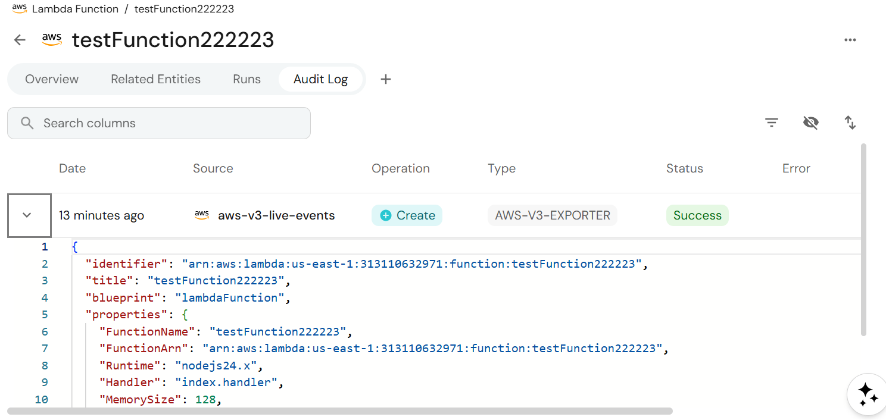

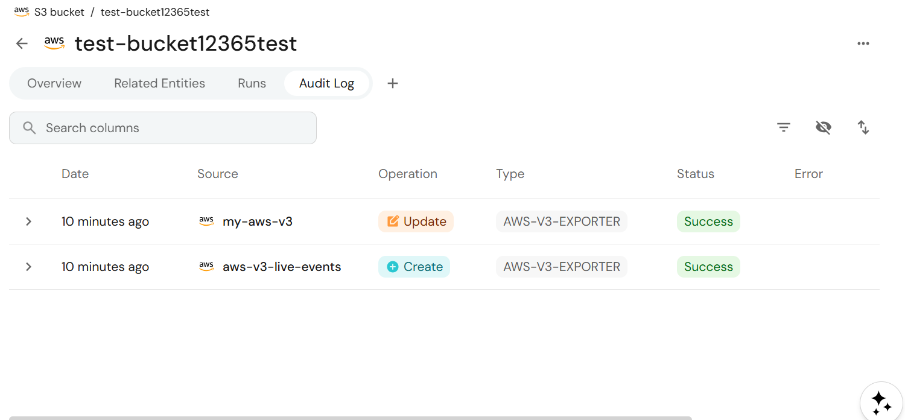

---

## 9. Reference

- ADR: [`docs/adr-live-events.md`](./adr-live-events.md)
- CloudFormation template: [`docs/cloudformation/live-events.yaml`](./cloudformation/live-events.yaml)
- Integration middleware: `integrations/aws-v3/aws/webhook/middleware.py`
- Per-kind processors: `integrations/aws-v3/aws/webhook/webhook_processors/`
- Registry: `integrations/aws-v3/aws/webhook/registry.py`
- Integration config keys: `integrations/aws-v3/.port/spec.yaml`
