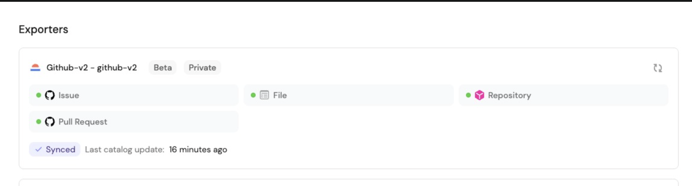
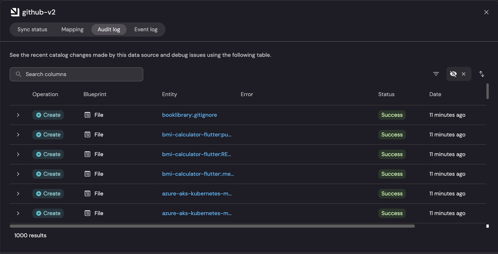
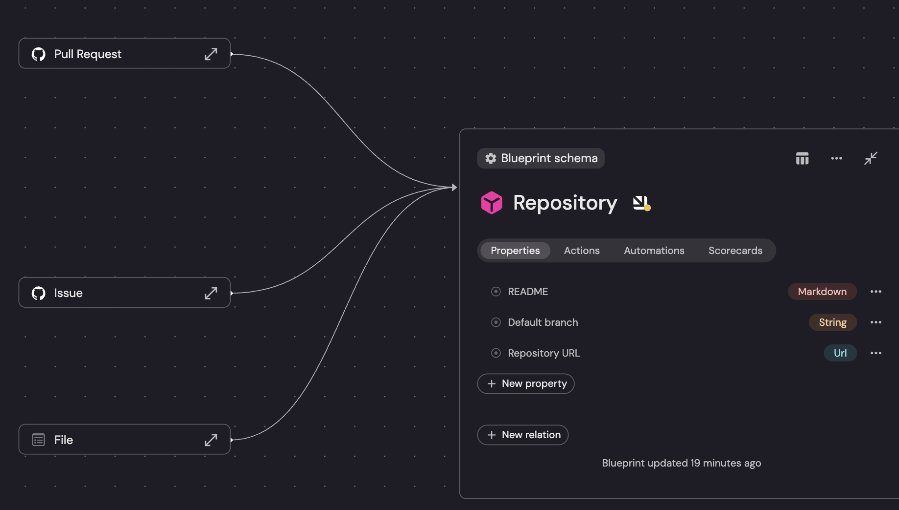

# GitHub v2 Integration for Port Ocean

This integration ingests GitHub data into [Port Ocean](https://www.getport.io/) and keeps it in sync using exporters and webhooks.

## Features

- Async HTTP client with pagination and rate‑limit handling
- Exporters: Repositories, Pull Requests, Issues, Files
- Org/User owner switching
- Webhooks: ping, issues, pull_request, repository
- PR filtering via settings (state, updatedSinceDays)
- Identifier sanitation for files
- Unit tests for exporters, REST client, and webhook processors

## Prerequisites

- Python 3.12+
- Poetry
- Port Ocean CLI (`pip install "port-ocean[cli]"`)

## Setup

```bash
cd integrations/github-v2
poetry install
```

Copy env and set credentials:

```bash
# .env
OCEAN__PORT__CLIENT_ID=...
OCEAN__PORT__CLIENT_SECRET=...
OCEAN__BASE_URL=http://localhost:8000            # public URL for webhooks

OCEAN__INTEGRATION__CONFIG__GITHUB_HOST=https://api.github.com
OCEAN__INTEGRATION__CONFIG__GITHUB_TOKEN=...
OCEAN__INTEGRATION__CONFIG__GITHUB_ORGANIZATION=...   # or set GITHUB_USER
OCEAN__INTEGRATION__CONFIG__GITHUB_USER=
OCEAN__INTEGRATION__CONFIG__WEBHOOK_SECRET=

# Optional PR filters (default: all)
OCEAN__INTEGRATION__CONFIG__PULL_REQUEST_STATE=all      # open|closed|all
OCEAN__INTEGRATION__CONFIG__PULL_REQUEST_UPDATED_SINCE_DAYS=
```

Run:

```bash
make run
```

To auto‑apply blueprints and mappings on first run:

```bash
OCEAN__INITIALIZE_PORT_RESOURCES=true make run
```

## Screenshots

### Exporters (Synced)


### Audit Log


### Blueprint Graph


## Webhooks

- Base URL: `${OCEAN__BASE_URL}/integration/webhook`
- Set `OCEAN__BASE_URL` to a public address (e.g., ngrok) for GitHub to call
- `WEBHOOK_SECRET` is optional; if set, signatures are verified

## Blueprints and Mappings

- Blueprints: `integrations/github-v2/.port/resources/blueprints.json`
- Mappings: `integrations/github-v2/.port/resources/port-app-config.yml`

File identifiers are sanitized to match Port’s regex:

```yaml
identifier: '(.repository.name + ":" + .path) | gsub("[^A-Za-z0-9@_.+:\\/=-]"; "_")'
```

## Tests

```bash
poetry run pytest -n auto
```

Includes tests for exporters (incl. filters), REST client (rate limits, pagination), and webhook processors.

## Troubleshooting

- “Waiting for first record”: ensure entities created by this instance have `$datasource` containing `port-ocean/github-v2/`. Refresh/resync if needed.
- 404 blueprint not found: apply defaults (`OCEAN__INITIALIZE_PORT_RESOURCES=true make run` or `ocean defaults dock`).
- 409 other_migration_running_on_blueprint: wait a minute and try applying defaults again.

## References

- Install & use: https://docs.port.io/build-your-software-catalog/sync-data-to-catalog/
- Develop: https://ocean.getport.io/develop-an-integration/