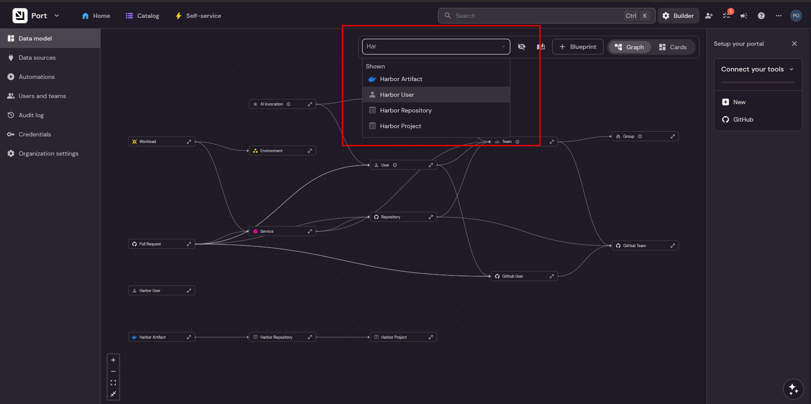

# Harbor Integration Blueprints (Terraform)

This module creates the required Blueprints in Port for the Harbor Ocean integration.

## Prerequisites

- [Terraform](https://www.terraform.io/downloads) installed
- Port Client ID & Secret (from **Port → Credentials → Client ID & Secret**)

## Usage

1. Create `secrets.tfvars`:
   ```hcl
   port_client_id     = "your-client-id"
   port_client_secret = "your-client-secret"
   ```


