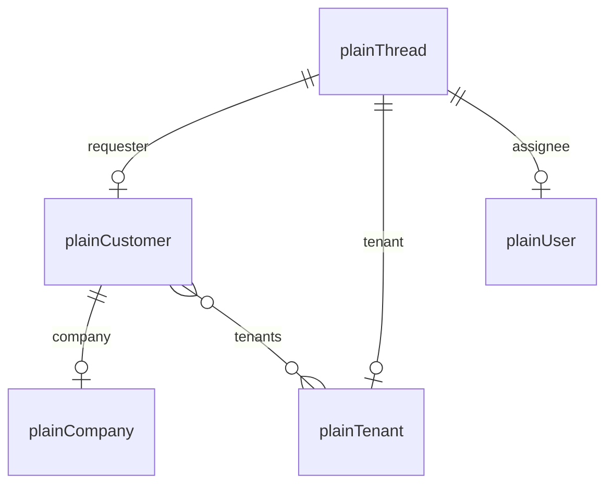

# Plain Ocean Integration — Implementation Plan

> Status: **Draft for review**  
> Source: design discussion (Aug 20, 2026)  
> Decision: dedicated `integrations/plain/` integration (Linear-style), **not** custom Ocean and **not** a generic GraphQL fork.  
> **Executable task list (prerequisites + per-task tests):** [TASKS.md](./TASKS.md)

## Summary

Build a Port Ocean integration for [Plain](https://www.plain.com/) that syncs support data into the Port catalog via Plain’s GraphQL API.

| Phase | Goal | Effort |
|-------|------|--------|
| **0 (optional POC)** | Custom Ocean, `pagination_type: none`, `first: 100` | ~1 day |
| **1** | Dedicated integration, **5 kinds**, resync only | **4.5–5.5 days** |
| **2** | Live events via Plain webhooks | **+3–4 days** |
| **3+ (optional)** | Extra catalog kinds (tasks, labels, help center, etc.) | TBD |

**Agreed Phase 1 set:** `thread`, `customer`, `tenant`, `user`, `company`

---

## Why a dedicated integration?

Plain uses Relay cursor pagination in the GraphQL **request body** (`variables.after` / `variables.first`).

The custom Ocean integration only injects pagination into **URL query parameters**, so multi-page GraphQL sync does not work today.

| Need | Custom Ocean | Dedicated Plain |
|------|--------------|-----------------|
| Full thread pagination (Relay) | Not supported today | Built-in |
| Rich thread model (customer, tenant, assignee, labels, fields) | Manual JQ mapping | Curated blueprints |
| Multiple resources | One GraphQL resource per mapping | Native kinds |
| Live updates | No | Plain webhooks |
| Time to first demo | Faster (~1 day with `pagination: none`) | Slower |
| Long-term maintenance | Consumer-owned mappings | Integration-owned |

**Recommendation:** dedicated Plain integration for production use. Use custom Ocean only for a short POC.

### Alternatives considered

| Approach | Time | When to use |
|----------|------|-------------|
| Custom + `pagination: none`, `first: 100` | ~1 day | Demo / &lt;100 entities |
| Custom + `body_cursor` enhancement | 2–3 days | Generic GraphQL product need |
| Generic GraphQL fork of custom | 5–7 days | Platform product; overkill for Plain alone |
| **Dedicated Plain Phase 1** | **4.5–5.5 days** | **Chosen path** |
| Dedicated + webhooks | **7–9 days** | Near real-time production |

---

## API basics

| Item | Value |
|------|--------|
| Endpoint | `POST https://core-api.uk.plain.com/graphql/v1` |
| Auth | `Authorization: Bearer <apiToken>` |
| Pagination | Relay (`first` / `after`), max **100** per page |
| Pattern reference in-repo | `integrations/linear/` |

Useful docs:

- [GraphQL introduction](https://www.plain.com/docs/graphql/introduction)
- [Pagination](https://www.plain.com/docs/graphql/pagination.md)
- [Webhooks](https://www.plain.com/docs/webhooks.md)
- [Request signing](https://www.plain.com/docs/request-signing.md)
- [API explorer](https://app.plain.com/developer/api-explorer/)

---

## Phase 1 — Resync MVP (production baseline)

### Scope

| Kind | GraphQL query | Blueprint (suggested) | Priority |
|------|---------------|----------------------|----------|
| `thread` | `threads` | `plainThread` | P0 |
| `customer` | `customers` | `plainCustomer` | P0 |
| `tenant` | `tenants` | `plainTenant` | P0 |
| `user` | `users` | `plainUser` | P1 |
| `company` | `companies` | `plainCompany` | P1 |

**Out of scope for Phase 1:** webhooks, live events, search queries, mutations, Tier 2–5 kinds.

### Catalog model (relations)



| From | Relation | To | Source field |
|------|----------|-----|--------------|
| `plainThread` | `customer` | `plainCustomer` | `thread.customer.id` |
| `plainThread` | `tenant` | `plainTenant` | `thread.tenant.id` |
| `plainThread` | `assignee` | `plainUser` | `thread.assignedTo.id` (when `__typename == "User"`) |
| `plainCustomer` | `company` | `plainCompany` | `customer.company.id` |
| `plainCustomer` | `tenants` | `plainTenant` | `customer.tenants[].id` (if exposed in query) |

Use `createMissingRelatedEntities: true` so threads can sync even if related entities have not synced yet.

### Suggested project structure

Design the client so Phase 2 only adds webhook processors — no client rewrite.

```text
integrations/plain/
├── plain/
│   ├── client.py           # GraphQL POST + Relay pagination + error handling
│   ├── queries.py          # LIST_THREADS, LIST_CUSTOMERS, etc.
│   ├── utils.py            # ObjectKind enum, flatten edges→nodes
│   └── exceptions.py       # PlainGraphQLError
├── main.py                 # @ocean.on_resync per kind
├── integration.py
├── .port/
│   ├── spec.yaml           # apiToken (bearer), optional threadStatusFilter
│   └── resources/
│       ├── port-app-config.yaml
│       └── blueprints.json
└── tests/
    ├── test_client.py      # pagination, errors
    └── test_queries.py     # response parsing
```

**Phase 2 additions (planned, not built in Phase 1):**

```text
├── webhook_processors/
│   ├── plain_abstract_webhook_processor.py
│   ├── thread_webhook_processor.py
│   └── customer_webhook_processor.py
└── plain/webhook_setup.py  # createWebhookTarget on @ocean.on_start
```

### Client design (Phase 1 + Phase 2-ready)

#### Generic Relay paginator (write once, reuse for all 5 kinds)

```python
async def paginate_connection(
    self,
    query: str,
    operation_name: str,
    variables: dict,
    connection_path: str,  # e.g. "data.threads"
) -> AsyncGenerator[list[dict], None]:
    after = None
    while True:
        page_vars = {**variables, "first": PAGE_SIZE, "after": after}
        data = await self.execute(query, page_vars, operation_name)
        connection = get_nested(data, connection_path)
        yield [edge["node"] for edge in connection["edges"]]
        if not connection["pageInfo"]["hasNextPage"]:
            break
        after = connection["pageInfo"]["endCursor"]
```

- Default page size: **100** (Plain max).
- Raise clearly on GraphQL `errors` in the response body (do not treat as an empty page).

#### Single-entity fetch (stub for Phase 2)

Add in Phase 1; use later when a webhook provides an entity ID:

```python
async def get_thread(self, thread_id: str) -> dict: ...
async def get_customer(self, customer_id: str) -> dict: ...
# optionally: get_tenant / get_user / get_company
```

### Per-kind implementation notes

#### 1. `thread` (largest effort — ~1–1.5 days)

- Query: `threads` — [docs](https://www.plain.com/docs/graphql/threads/get.md)
- Permission: `thread:read`
- Pagination: Relay (`first` / `after`, max 100/page)
- Key fields: `id`, `ref`, `externalId`, `title`, `status`, `priority`, `customer`, `tenant`, `assignedTo`, `labels`, `threadFields`, timestamps

**Mapping highlights:**

- `identifier`: `.id`
- `title`: `.title // .ref`
- `assignee` relation: only when `assignedTo.__typename == "User"`
- Store machine-user assignee as a property if needed (no `machine-user` kind in Phase 1)

**Optional install config:** `threadStatusFilter` (`TODO`, `DONE`, etc.) passed into `variables.filters`.

#### 2. `customer` (~0.5 day)

- Query: `customers` — [docs](https://www.plain.com/docs/graphql/customers/get.md)
- Permission: `customer:read`
- Key fields: `id`, `externalId`, `fullName`, `email`, `company`, `createdAt`, `updatedAt`

#### 3. `tenant` (~0.5 day)

- Query: `tenants` — [docs](https://www.plain.com/docs/graphql/tenants/get.md)
- Permission: tenant read
- Key fields: `id`, `externalId`, `name`, `createdAt`, `updatedAt` (+ tenant custom fields if needed)

#### 4. `user` (~0.5 day)

- Query: `users`
- Permission: user read
- Key fields: `id`, `fullName`, `email`, `status`, `role` (if available)
- Used mainly as assignee relation target from threads

#### 5. `company` (~0.5 day)

- Query: `companies` — [docs](https://www.plain.com/docs/graphql/companies/get-companies.md)
- Permission: company read
- Key fields: `id`, `externalId`, `name`, `domain`, `createdAt`, `updatedAt`
- **Optional cut** if only tenants are used (−0.5 day)

### Install configuration (`.port/spec.yaml`)

```yaml
configurations:
  - name: apiToken
    required: true
    type: string
    sensitive: true
    description: Plain API key (Bearer token)

  - name: apiUrl
    required: false
    type: url
    default: "https://core-api.uk.plain.com/graphql/v1"

  - name: pageSize
    required: false
    type: string
    default: "100"
    description: Max 100 per Plain API limits

  # Phase 2 placeholder — add now in spec as optional, wire in Phase 2
  - name: enableLiveEvents
    required: false
    type: boolean
    default: false
    description: "Phase 2: register Plain webhooks for real-time sync"

  # optional later:
  # - name: threadStatusFilter
```

Keep `enableLiveEvents` in the spec from day one (default `false`) so Phase 2 does not require a breaking install change.

### Suggested `port-app-config.yaml` resources block

```yaml
createMissingRelatedEntities: true
deleteDependentEntities: true

resources:
  - kind: company
  - kind: tenant
  - kind: user
  - kind: customer
  - kind: thread
```

Also list kinds in `spec.yaml` `features.exporter.resources` for Port UI discovery.

### Resync order

Ocean runs kinds independently. Relations work best if related entities exist, but with `createMissingRelatedEntities: true`, order does not block sync.

Recommended mental order:

1. `company`, `tenant`, `user`, `customer` (can run in parallel)
2. `thread` (references the above)

### API key permissions needed

Ask Plain admins for an API key with at least:

- `thread:read`
- `customer:read`
- tenant read
- user read
- company read

Confirm exact permission names in the [Plain API explorer](https://app.plain.com/developer/api-explorer/).

### Phase 1 effort breakdown

| Task | Days |
|------|------|
| Scaffold + spec + blueprints | 0.5 |
| Generic GraphQL client + pagination | 0.5–1 |
| 5 kinds (queries, handlers, mappings) | 2–2.5 |
| Tests | 1 |
| Docs + changelog | 0.25–0.5 |
| **Phase 1 total** | **4.5–5.5 days** |

### Phase 1 acceptance criteria

- [ ] All 5 kinds resync with full Relay pagination
- [ ] GraphQL errors fail clearly (not silent empty pages)
- [ ] Relations map correctly; `createMissingRelatedEntities` works
- [ ] Unit tests cover pagination, GraphQL error path, and smoke mapping
- [ ] `get_thread` / `get_customer` stubs exist
- [ ] `enableLiveEvents` present in spec (default `false`)
- [ ] README + example config + changelog

---

## Phase 2 — Live events (webhooks)

### Events to support first

| Webhook event | Action | Uses |
|---------------|--------|------|
| `thread.created` | Upsert thread | `get_thread(id)` |
| `thread.status_transitioned` | Update thread | `get_thread(id)` |
| `thread.assignment_transitioned` | Update thread | `get_thread(id)` |
| `customer.created` | Upsert customer | `get_customer(id)` |
| `customer.updated` | Update customer | `get_customer(id)` |
| `customer.deleted` | Delete entity | webhook payload ID |

Reference: [Plain webhooks](https://www.plain.com/docs/webhooks.md)

### Phase 2 architecture hooks to add in Phase 1

1. **`get_thread()` / `get_customer()`** in client (even if unused initially)
2. **Webhook payload parser** — typed model for event body
3. **`spec.yaml`** — `enableLiveEvents` flag (disabled)
4. **`main.py`** — guarded `@ocean.on_start` stub for webhook registration
5. **Signature verification helper** — [request signing docs](https://www.plain.com/docs/request-signing.md)

### Phase 2 effort estimate

| Task | Days |
|------|------|
| Webhook target setup on `on_start` (gated by `enableLiveEvents`) | 0.5–1 |
| 2–3 processors (thread created/updated, customer updated) | 1.5–2 |
| Signature verification + tests | 1 |
| **Phase 2 total** | **+3–4 days** |

### Phase 2 acceptance criteria

- [ ] With `enableLiveEvents: true`, webhook target is registered
- [ ] Signature verification rejects invalid requests
- [ ] Thread create / status / assignment events upsert catalog entities
- [ ] Customer create/update upsert; delete removes entity
- [ ] Tests cover auth failure and happy path per processor

---

## Phase 3+ — Optional kinds backlog

Not in MVP scope. Use as a future expansion menu.

### Tier 1 remaining

| Kind | GraphQL query | Notes |
|------|---------------|------|
| `machine-user` | `machineUsers` | AI/bot assignees |
| `label-type` | `labelTypes` | Tag definitions (labels usually embedded on thread) |

### Tier 2 — Thread ecosystem

| Kind | GraphQL query | What it is |
|------|---------------|------------|
| `task` | `tasks` | Follow-up tasks on threads |
| `note` | notes / timeline | Internal notes |
| `thread-field-schema` | `threadFieldSchemas` | Custom field definitions |
| `tenant-field-schema` | `tenantFieldSchemas` | Tenant custom field definitions |
| `customer-group` | `customerGroups` | Customer segmentation |
| `tier` | `tiers` | Support / priority tiers |
| `discussion` | `discussions` | Internal team discussions |
| `snippet` | `snippets` | Canned responses |
| `timeline-entry` | `timelineEntries` | Thread activity items |

### Tier 3 — Help center & knowledge

| Kind | Notes |
|------|------|
| `help-center` | Help center sites |
| `help-center-article` | KB articles |
| `help-center-article-group` | Article categories |
| `knowledge-source` | Indexed knowledge for AI |
| `indexed-document` | Documents in knowledge base |

### Tier 4 — Operations / config (usually lower priority for catalog)

`webhook-target`, `autoresponder`, `escalation-path`, `workflow`, `workflow-rule`, `broadcast`, `customer-card-config`, `workspace`

### Tier 5 — Channel integrations (rarely needed in Port catalog)

Slack / Discord / Teams / Linear / Jira / GitHub / Sidekick / chat-app configuration — skip unless there is a specific catalog need.

---

## Suggested implementation order (PR / task checklist)

1. Scaffold `integrations/plain/` (pyproject, Makefile, `integration.py`, spec)
2. Client: `execute` + `paginate_connection` + GraphQL error handling
3. Queries + resync for `company`, `tenant`, `user`, `customer`
4. Queries + resync for `thread` (largest)
5. Blueprints + `port-app-config` relations
6. Single-entity getters + `enableLiveEvents` stub
7. Tests + README + changelog
8. *(Later)* Phase 2 webhook setup + processors

---

## Open questions for reviewers

1. Confirm **5 kinds** for Phase 1 vs cutting `company` (−0.5 day).
2. Confirm default API URL (`core-api.uk.plain.com`) vs US / other Plain regions.
3. Confirm which thread filters are needed at install time (status, labels, tenants).
4. Confirm whether Phase 2 webhooks are required for the first production release or can follow later.
5. Confirm ownership / target repo branch and review path (maintaining team PR).

---

## Full production estimate

| Scope | Effort |
|-------|--------|
| Phase 1 only | **4.5–5.5 days** |
| Phase 1 + Phase 2 | **7–9 days** |

---

## Next step after approval

Scaffold `integrations/plain/` with:

1. Client + generic Relay paginator
2. All Phase 1 kinds (queries, handlers, mappings)
3. Blueprints + relations
4. Phase 2 stubs (`get_thread`, `get_customer`, `enableLiveEvents` in spec)
