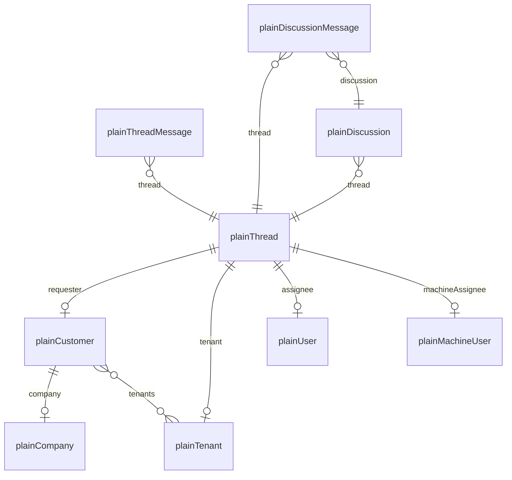

# Plain Ocean Integration — Implementation Plan

> Status: **Phase 1 + Phase 2 complete**  
> Source: design discussion (Aug 20, 2026); Phase 1 kinds expanded Sep 2026; Phase 2 live events Sep 2026  
> Decision: dedicated `integrations/plain/` integration (Linear-style), **not** custom Ocean and **not** a generic GraphQL fork.  
> **Executable task list (prerequisites + per-task tests):** [TASKS.md](./TASKS.md)

## Summary

Build a Port Ocean integration for [Plain](https://www.plain.com/) that syncs support data into the Port catalog via Plain’s GraphQL API.

| Phase | Goal | Effort | Status |
|-------|------|--------|--------|
| **0 (optional POC)** | Custom Ocean, `pagination_type: none`, `first: 100` | ~1 day | Skipped |
| **1** | Dedicated integration, **8 kinds**, resync only | Done | **Complete** |
| **2** | Live events via Plain webhooks (all 8 kinds) | Done | **Complete** |
| **3+ (optional)** | Extra catalog kinds (tasks, labels, help center, etc.) | TBD | Backlog |

**Phase 1 kinds (shipped):** `company`, `tenant`, `user`, `customer`, `thread`, `thread-message`, `discussion`, `discussion-message`

Originally scoped to five kinds (`thread`, `customer`, `tenant`, `user`, `company`). Phase 1 also shipped the thread-conversation kinds below so Port can model customer-facing timeline messages and internal discussions.

---

## Why a dedicated integration?

Plain uses Relay cursor pagination in the GraphQL **request body** (`variables.after` / `variables.first`).

The custom Ocean integration only injects pagination into **URL query parameters**, so multi-page GraphQL sync does not work today.

| Need | Custom Ocean | Dedicated Plain |
|------|--------------|-----------------|
| Full thread pagination (Relay) | Not supported today | Built-in |
| Rich thread model (customer, tenant, assignee, labels, fields) | Manual JQ mapping | Curated blueprints |
| Multiple resources | One GraphQL resource per mapping | Native kinds |
| Live updates | No | Plain webhooks (Phase 2) |
| Time to first demo | Faster (~1 day with `pagination: none`) | Slower |
| Long-term maintenance | Consumer-owned mappings | Integration-owned |

**Recommendation:** dedicated Plain integration for production use. Use custom Ocean only for a short POC.

### Alternatives considered

| Approach | Time | When to use |
|----------|------|-------------|
| Custom + `pagination: none`, `first: 100` | ~1 day | Demo / &lt;100 entities |
| Custom + `body_cursor` enhancement | 2–3 days | Generic GraphQL product need |
| Generic GraphQL fork of custom | 5–7 days | Platform product; overkill for Plain alone |
| **Dedicated Plain Phase 1** | **Done** | **Chosen path** |
| Dedicated + webhooks | **Phase 2 next** | Near real-time production |

---

## API basics

| Item | Value |
|------|--------|
| Endpoint | `POST https://core-api.uk.plain.com/graphql/v1` |
| Auth | `Authorization: Bearer <apiToken>` |
| Pagination | Relay (`first` / `after`), max **100** per page |
| Pattern reference in-repo | `integrations/linear/` |

Useful docs:

- [GraphQL introduction](https://www.plain.com/docs/graphql/introduction)
- [Pagination](https://www.plain.com/docs/graphql/pagination.md)
- [Webhooks](https://www.plain.com/docs/webhooks.md)
- [Request signing](https://www.plain.com/docs/request-signing.md)
- [API explorer](https://app.plain.com/developer/api-explorer/)

Verified API notes live in [API_NOTES.md](./API_NOTES.md).

---

## Phase 1 — Resync MVP (complete)

### Scope (shipped)

| Kind | GraphQL query | Blueprint | Notes |
|------|---------------|----------|-------|
| `company` | `companies` | `plainCompany` | Root list |
| `tenant` | `tenants` | `plainTenant` | Root list |
| `user` | `users` | `plainUser` | Root list; needs `roles:read` for `role` |
| `machine-user` | `machineUsers` | `plainMachineUser` | Root list; selector `excludeDeleted`; likely needs `machineUser:read` |
| `customer` | `customers` | `plainCustomer` | Root list; tenants via `tenantMemberships` |
| `thread` | `threads` | `plainThread` | Root list; selector `excludeDoneThreads` |
| `thread-message` | `thread.timelineEntries` | `plainThreadMessage` | Nested per thread; needs `timeline:read` |
| `discussion` | `discussions(filters: { threadIds })` | `plainDiscussion` | Nested per thread |
| `discussion-message` | `discussion.messages` | `plainDiscussionMessage` | Nested per discussion; stamps `threadId` |

**Out of scope for Phase 1 (still true):** webhooks, live events, search queries, mutations, remaining Tier 2–5 kinds.

### Catalog model (relations)


```mermaid
erDiagram
    plainThread ||--o| plainCustomer : requester
    plainThread ||--o| plainTenant : tenant
    plainThread ||--o| plainUser : assignee
    plainThread ||--o| plainMachineUser : machineAssignee
    plainCustomer ||--o| plainCompany : company
    plainCustomer }o--o{ plainTenant : tenants
    plainThreadMessage }o--|| plainThread : thread
    plainDiscussion }o--|| plainThread : thread
    plainDiscussionMessage }o--|| plainThread : thread
    plainDiscussionMessage }o--|| plainDiscussion : discussion
```

| From | Relation | To | Source field |
|------|----------|-----|--------------|
| `plainThread` | `customer` | `plainCustomer` | `thread.customer.id` |
| `plainThread` | `tenant` | `plainTenant` | `thread.tenant.id` |
| `plainThread` | `assignee` | `plainUser` | `thread.assignedTo.id` (when `__typename == "User"`) |
| `plainThread` | `machineAssignee` | `plainMachineUser` | `thread.assignedTo.id` (when `__typename == "MachineUser"`) |
| `plainCustomer` | `company` | `plainCompany` | `customer.company.id` |
| `plainCustomer` | `tenants` | `plainTenant` | `customer.tenantMemberships.edges[].node.tenant.id` |
| `plainThreadMessage` | `thread` | `plainThread` | stamped `threadId` on timeline entry |
| `plainDiscussion` | `thread` | `plainThread` | stamped / returned `threadId` |
| `plainDiscussionMessage` | `thread` | `plainThread` | stamped `threadId` |
| `plainDiscussionMessage` | `discussion` | `plainDiscussion` | `threadDiscussionId` |

`createMissingRelatedEntities: true` is set so child kinds can sync even if parents have not finished yet.

### Project structure (as built)

```text
integrations/plain/
├── plain/
│   ├── client.py           # GraphQL POST + Relay pagination + list/get helpers
│   ├── queries.py          # LIST_* / GET_* / THREAD_TIMELINE / THREAD_DISCUSSIONS / DISCUSSION_MESSAGES
│   ├── utils.py            # ObjectKind enum (8 kinds), flatten edges→nodes
│   └── exceptions.py       # PlainGraphQLError, PlainHTTPError
├── main.py                 # @ocean.on_resync per kind + enableLiveEvents on_start stub
├── integration.py          # ResourceConfig per kind (excludeDoneThreads where needed)
├── .port/
│   ├── spec.yaml           # apiToken, apiUrl, pageSize, threadStatusFilter, enableLiveEvents
│   └── resources/
│       ├── port-app-config.yml
│       └── blueprints.json
└── tests/
    ├── test_*.py           # per-kind + client + mapping tests
    └── fixtures/           # discussion_slack / email / message fixtures
```

**Phase 2 additions (still to build):**

```text
├── webhook_processors/
│   ├── plain_abstract_webhook_processor.py
│   ├── thread_webhook_processor.py
│   ├── customer_webhook_processor.py
│   ├── thread_message_webhook_processor.py   # optional / stretch
│   └── discussion_webhook_processor.py       # optional / stretch
└── plain/webhook_setup.py  # createWebhookTarget on @ocean.on_start
```

### Client design (shipped, Phase 2-ready)

#### Generic Relay paginator (all list kinds)

`paginate_connection(query, operation_name, variables, connection_path)` walks `first` / `after` until `hasNextPage` is false. Default page size **100** (Plain max). GraphQL `errors` raise; they are not treated as empty pages.

#### Nested kinds (thread-scoped)

`thread-message`, `discussion`, and `discussion-message` are not root lists:

1. Page thread IDs (`get_thread_ids`, respects status filter / `excludeDoneThreads`)
2. For each thread, page nested connections:
   - messages → `thread.timelineEntries` (entries with text only)
   - discussions → `discussions(filters: { threadIds: [$threadId] })`
   - discussion messages → for each discussion, `discussion.messages`, then stamp `threadId`

#### Single-entity fetch (Phase 2 stubs — present)

```python
async def get_thread(self, thread_id: str) -> dict: ...
async def get_customer(self, customer_id: str) -> dict: ...
```

Still missing for richer live events (add in Phase 2 as needed):

```python
async def get_thread_message / timeline entry by id  # if Plain exposes it
async def get_discussion(self, discussion_id: str) -> dict: ...
async def get_discussion_message(...)  # or re-fetch discussion.messages page
```

### Per-kind notes (as shipped)

#### 1. `thread`

- Query: `threads` — [docs](https://www.plain.com/docs/graphql/threads/get.md)
- Permission: `thread:read`
- Selector: `excludeDoneThreads` → sync `TODO` + `SNOOZED` only when `true`
- `assignee` when `assignedTo.__typename == "User"`; `machineAssignee` when `MachineUser`; `System` has no relation

#### 2. `customer`

- Query: `customers` — [docs](https://www.plain.com/docs/graphql/customers/get.md)
- Permissions: `customer:read`, plus `customerTenantMembership:read` for tenants
- Tenants mapped from first page of `tenantMemberships` (max 100)

#### 3. `tenant` / `user` / `company`

- Root Relay lists as originally planned
- User `role` needs `roles:read`
- Company fields: `id`, `name`, `domainName` (no `externalId`)

#### 4. `thread-message` (added in Phase 1)

- Source: `thread.timelineEntries` (permission `timeline:read`)
- Only entries with message text (`llmText` / equivalent) are yielded
- Related to parent `plainThread` via stamped `threadId`
- Selector: same `excludeDoneThreads` as threads

#### 5. `discussion` (added in Phase 1; was Tier 2 backlog)

- Source: `discussions` filtered by `threadIds`
- Channel derived from `channelDetails.__typename` → `SLACK` / `EMAIL` / `CURSOR` / `AGENT_SESSION`
- Selector: `excludeDoneThreads` plus `excludeAiDiscussions` (skips Cursor and agent-session channels)
- Slack link + email recipients mapped when present
- Related to parent `plainThread`

#### 6. `discussion-message` (added in Phase 1)

- Source: `discussion.messages`
- Selector: same `excludeDoneThreads` / `excludeAiDiscussions` as discussion
- Related to both `plainDiscussion` (`threadDiscussionId`) and `plainThread` (stamped `threadId`)

### Install configuration (`.port/spec.yaml`) — as shipped

| Spec name | Required | Default | Purpose |
|-----------|----------|---------|---------|
| `apiToken` | yes | | Bearer token |
| `apiUrl` | no | UK GraphQL URL | Override if Plain adds regions |
| `pageSize` | no | `100` | Capped at 100 |
| `threadStatusFilter` | no | unset | Fallback status list for fetches without an explicit list |
| `enableLiveEvents` | no | `false` | Phase 2 gate; `on_start` skips registration when false |

Thread / message / discussion resync uses selector `excludeDoneThreads`, not `threadStatusFilter`, for the open-vs-all filter.

### Resources order in `port-app-config.yml`

```yaml
createMissingRelatedEntities: true
deleteDependentEntities: true

resources:
  - kind: company
  - kind: tenant
  - kind: user
  - kind: customer
  - kind: thread
  - kind: thread-message
  - kind: discussion
  - kind: discussion-message
```

Kinds are also listed in `spec.yaml` `features.exporter.resources`.

### Resync order

Ocean runs kinds independently. Recommended mental order:

1. `company`, `tenant`, `user`, `customer` (parallel-safe)
2. `thread`
3. `thread-message`, `discussion` (need thread IDs)
4. `discussion-message` (needs discussions + stamped thread id)

### API key permissions needed

Ask Plain admins for an API key with at least:

- `company:read`
- `tenant:read`
- `user:read` (+ `roles:read` for role name)
- `customer:read` (+ `customerTenantMembership:read` for tenant links)
- `thread:read`
- `timeline:read` (thread messages)
- Discussion / discussion-message permissions are not named in the public schema; confirm in the [API explorer](https://app.plain.com/developer/api-explorer/)

### Phase 1 acceptance criteria

- [x] All shipped kinds resync with full Relay pagination
- [x] GraphQL errors fail clearly (not silent empty pages)
- [x] Relations map correctly; `createMissingRelatedEntities` works
- [x] Unit tests cover pagination, GraphQL error path, and smoke mapping (incl. discussion fixtures)
- [x] `get_thread` / `get_customer` stubs exist
- [x] `enableLiveEvents` present in spec (default `false`); `on_start` gated stub
- [x] README + example config + changelog / release intent as needed

---

## Phase 2 — Live events (webhooks) — **next**

Phase 2 builds on the **8-kind** catalog. Minimum viable live events cover thread + customer (original plan). Extend to conversation kinds once single-entity getters and Plain event coverage are confirmed.

### Events to support first (MVP)

| Webhook event | Action | Uses |
|---------------|--------|------|
| `thread.thread_created` / `thread.created` | Upsert thread | `get_thread(id)` |
| `thread.thread_status_transitioned` / `thread.status_transitioned` | Update thread | `get_thread(id)` |
| `thread.thread_assignment_transitioned` / `thread.assignment_transitioned` | Update thread | `get_thread(id)` |
| `customer.created` | Upsert customer | `get_customer(id)` |
| `customer.updated` | Update customer | `get_customer(id)` |
| `customer.deleted` | Delete entity | webhook payload ID |

Confirm exact event type strings against [Plain webhooks](https://www.plain.com/docs/webhooks.md) / the current event catalog before implementing.

### Events to support next (conversation kinds — stretch in Phase 2 or early Phase 3)

These keep `thread-message`, `discussion`, and `discussion-message` fresh without full resync. Prefer upsert-via-fetch when Plain exposes a stable ID in the payload.

| Area | Likely event families | Handler approach |
|------|----------------------|------------------|
| Thread timeline / messages | Channel events (`thread.email_received`, `thread.chat_received`, `thread.slack_message_received`, …) and/or timeline events | Upsert `plainThreadMessage` (and often refresh parent thread); may need new getter or payload mapping |
| Discussions | Discussion created / updated / resolved (confirm names in Plain docs) | Upsert `plainDiscussion` via `get_discussion(id)` once added |
| Discussion messages | Discussion message created / updated | Upsert `plainDiscussionMessage`; stamp `threadId` + `discussion` relation |

If Plain does not expose single-entity timeline/discussion fetches, fall back to: on thread activity → re-fetch nested pages for that thread only (cheaper than full resync).

### Phase 2 architecture hooks (already in Phase 1)

1. **`get_thread()` / `get_customer()`** in client — done
2. **`spec.yaml`** — `enableLiveEvents` flag (disabled) — done
3. **`main.py`** — gated `@ocean.on_start` stub for webhook registration — done (logs only; real registration is Phase 2)
4. **Still to add:** webhook payload parser, signature verification, processors, `webhook_setup.py`, optional getters for discussion / timeline entry

### Phase 2 effort estimate

| Task | Days |
|------|------|
| Webhook target setup on `on_start` (gated by `enableLiveEvents`) | 0.5–1 |
| Thread + customer processors (MVP) | 1.5–2 |
| Signature verification + tests | 1 |
| Conversation-kind processors + getters (stretch) | +1–1.5 |
| **Phase 2 MVP total** | **+3–4 days** |
| **Phase 2 + conversation live events** | **+4–5.5 days** |

### Phase 2 acceptance criteria

- [x] With `enableLiveEvents: true`, webhook target is registered for all catalog-kind events
- [x] Signature verification rejects invalid requests (`webhookSecret` / `Plain-Request-Signature`)
- [x] Thread create / status / assignment / labels / fields / tenant events upsert catalog entities
- [x] Customer create/update upsert; delete removes entity
- [x] Thread-message, discussion, and discussion-message live updates
- [x] Company / tenant / user refreshed from related customer/thread events (no dedicated Plain webhooks)
- [x] Tests cover signature failure, setup, and processor happy paths

---

## Phase 3+ — Optional kinds backlog

Not in Phase 1/2 scope. `discussion` / discussion messages moved **out** of this backlog (shipped in Phase 1).

### Tier 1 remaining

| Kind | GraphQL query | Notes |
|------|---------------|------|
| ~~`machine-user`~~ | — | **Shipped as `plainMachineUser` with thread `machineAssignee` relation** |
| `label-type` | `labelTypes` | Tag definitions (labels usually embedded on thread) |

### Tier 2 — Thread ecosystem

| Kind | GraphQL query | What it is |
|------|---------------|------------|
| `task` | `tasks` | Follow-up tasks on threads |
| `note` | notes / timeline | Internal notes (overlap with thread-message — evaluate before adding) |
| `thread-field-schema` | `threadFieldSchemas` | Custom field definitions |
| `tenant-field-schema` | `tenantFieldSchemas` | Tenant custom field definitions |
| `customer-group` | `customerGroups` | Customer segmentation |
| ~~`tier`~~ | — | **Embedded on `thread` as string property `.tier.name` (not a separate kind)** |
| `snippet` | `snippets` | Canned responses |
| ~~`discussion`~~ | — | **Shipped in Phase 1** |
| ~~`timeline-entry`~~ | — | **Covered by `thread-message` in Phase 1** |

### Tier 3 — Help center & knowledge

| Kind | Notes |
|------|------|
| `help-center` | Help center sites |
| `help-center-article` | KB articles |
| `help-center-article-group` | Article categories |
| `knowledge-source` | Indexed knowledge for AI |
| `indexed-document` | Documents in knowledge base |

### Tier 4 — Operations / config (usually lower priority for catalog)

`webhook-target`, `autoresponder`, `escalation-path`, `workflow`, `workflow-rule`, `broadcast`, `customer-card-config`, `workspace`

### Tier 5 — Channel integrations (rarely needed in Port catalog)

Slack / Discord / Teams / Linear / Jira / GitHub / Sidekick / chat-app configuration — skip unless there is a specific catalog need.

---

## Suggested implementation order

### Phase 1 (done)

1. ~~Scaffold `integrations/plain/`~~
2. ~~Client: `execute` + `paginate_connection` + GraphQL error handling~~
3. ~~Queries + resync for `company`, `tenant`, `user`, `customer`, `thread`~~
4. ~~Queries + resync for `thread-message`, `discussion`, `discussion-message`~~
5. ~~Blueprints + `port-app-config` relations~~
6. ~~Single-entity getters + `enableLiveEvents` stub~~
7. ~~Tests + README~~

### Phase 2 (next)

1. Payload parsing + signature verification (`P2-T1` in [TASKS.md](./TASKS.md))
2. Abstract webhook processor + `/webhook` route (`P2-T2`)
3. Thread webhook processors using `get_thread` (`P2-T3`)
4. Customer webhook processors using `get_customer` (`P2-T4`)
5. Webhook target registration when `enableLiveEvents=true` (`P2-T5`)
6. Docs + gate (`P2-T6`)
7. *(Stretch)* Discussion / thread-message processors + any missing single-entity getters

---

## Open questions for Phase 2

1. Exact Plain webhook **event type strings** for thread status/assignment and for discussion / timeline activity (docs vs live catalog).
2. Whether Phase 2 MVP should stay at thread + customer only, or include conversation kinds in the first live-events PR.
3. Whether Plain exposes **single-entity** queries for timeline entries / discussion messages, or handlers should re-fetch nested pages by parent ID.
4. Webhook signing secret storage: install config vs Ocean secrets pattern used by other integrations (e.g. Linear).
5. Confirm whether `createWebhookTarget` mutation permissions are on the same API key used for resync.

---

## Full production estimate

| Scope | Effort |
|-------|--------|
| Phase 1 (8 kinds, resync) | **Done** |
| Phase 2 MVP (thread + customer webhooks) | **+3–4 days** |
| Phase 2 + conversation live events | **+4–5.5 days** |

---

## Next step

Start **Phase 2** from [TASKS.md](./TASKS.md) (`P2-T1` onward):

1. Signature verification + payload models
2. Abstract processor + thread/customer processors
3. Register webhook target when `enableLiveEvents` is true
4. Decide stretch scope for `thread-message` / `discussion` / `discussion-message` live updates
